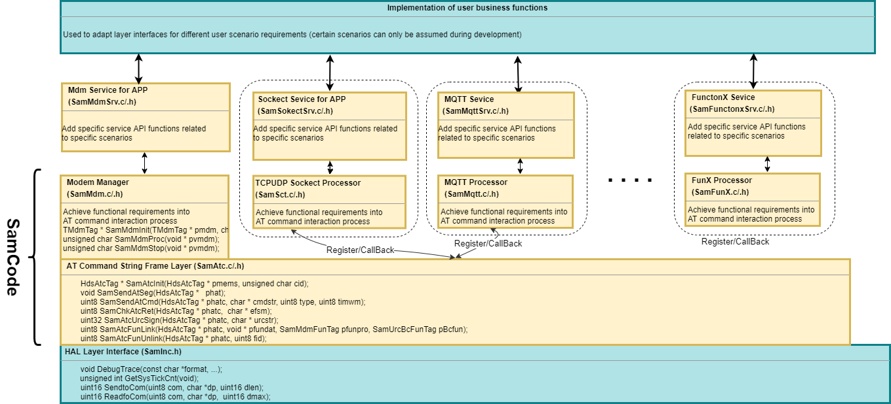

- [English](README.md)  
- [Chinese](README_cn.md)

<h1 style="text-align:center">SAM_ATCDRV</h1>

SAM_ATCDRV (SIMCom Application Module: AT Commands Driver) is a driver source code library developed based on the SIMCom Wireless module ATC interface for various application functions. It is provided for SIMCom customers' software engineers as a reference for module ATC programming.
This project is a test program that controls SIMCOM cellular wireless modules through serial port sending and receiving AT commands, realizing functions such as module initialization configuration, network registration, status monitoring and maintenance. It manages the module life cycle through a state machine, encapsulates the AT command sending and receiving logic, and provides upper-layer service interfaces.
For product information about SIMCOM cellular modules, please visit the SIMCom company website [SIMCom Website](https://en.simcom.com/module). For relevant technical support, please send an email to [support@simcom.com](support@simcom.com).

The SAM_ATCDRV source code library is mainly written for resource-constrained MCUs and does not require RTOS system support. The entire code package runs as a state machine embedded in a single loop.
It is a set of concise and flexible code frameworks that are easy to expand application functions. The code implementation tries to minimize resource occupation while facilitating configuration and expansion of application functions.
The following content is an introduction to the relevant topics of the SAM_ATCDRV source code library:

- [Software Framework and Porting Requirements of SAM_ATCDRV](#software-framework-and-porting-requirements-of-sam_atcdrv)
- [AT Command Frame Processing Layer of SAM_ATCDRV](#at-command-frame-processing-layer-of-sam_atcdrv)
- [MODEM State Maintenance Processor of SAM_ATCDRV](#modem-state-maintenance-processor-of-sam_atcdrv)
- [Application Function SOCKET Processing Unit of SAM_ATCDRV](_htmresc/Application%20Function%20Socket%20Processing%20Unit%20of%20SAM_ATCDRV.md)
- [Application Function MQTT Processing Unit of SAM_ATCDRV](_htmresc/Application%20Function%20MQTT%20Processing%20Unit%20of%20SAM_ATCDRV.md)  
- [Application Function TTS Processing Unit of SAM_ATCDRV](_htmresc/Application%20Function%20TTS%20Processing%20Unit%20of%20SAM_ATCDRV.md)
- [Application Function AUDIO Processing Unit of SAM_ATCDRV](_htmresc/Application%20Function%20AUDIO%20Processing%20Unit%20of%20SAM_ATCDRV.md)

### Software Framework and Porting Requirements of SAM_ATCDRV
The block diagram of the SAM_ATCDRV source code library is as follows. Currently, this source code library mainly implements: AT command frame interaction, MODEM state maintenance, and related business functions (TCP/UDP, MQTT, TTS, AUDIO, etc. are being supplemented one after another).

#### step1 It can be seen from the block diagram that the following functions need to be implemented first when porting the library:

| Function | extern void DebugTrace(const char *format, ...); |
|---|---|
| Functionality | Debug information printing function |
| Description | Format and output debug information, support variable parameters, used for tracking program running status and problem location |
| Parameters | format - Format string (same as printf), including placeholders (such as %s, %d, etc.) |
| Parameters | ... - Variable parameter list, corresponding to placeholders in the format string |
| Return Value | None |
| Example | DebugTrace("Send AT command: %s\r\n", cmd); |

| Function Name | extern unsigned int GetSysTickCnt(void); |
|---|---|
| Functionality | Get system tick count (in milliseconds) |
| Description | Encapsulate the system API to obtain the current system running time, return the number of milliseconds from system startup to the current time, used for timing and delay judgment |
| Parameters | None |
| Return Value | System tick count (unsigned int), unit is milliseconds |
| Example | unsigned int now = GetSysTickCnt (); // Get current system timestamp |

| Function | extern unsigned short SendtoCom(unsigned char com, char *dp, unsigned short dlen); |
|---|---|
| Functionality | Send data to the specified serial port |
| Description | Underlying serial port sending interface, responsible for sending data to the module through the hardware serial port (non-blocking) |
| Parameters | com - Serial port ID (such as 1, 2, etc., corresponding to different physical serial ports) |
| Parameters | dp - Pointer to the buffer of data to be sent |
| Parameters | dlen - Length of data to be sent (number of bytes) |
| Return Value | Number of actually sent bytes (unsigned short) |
| Example | SendtoCom(1, "AT+CSQ\r", 6);  // Send signal query command to serial port 1 |

| Function | extern unsigned short ReadfoCom(unsigned char com, char *dp,  unsigned short dmax); |
|---|---|
| Functionality | Read data from the specified serial port |
| Description | Underlying serial port receiving interface, read data returned by the module from the hardware serial port (non-blocking) |
| Parameters | com - Serial port ID (such as 1, 2, etc., corresponding to different physical serial ports) |
| Parameters | dp - Pointer to the buffer for storing read data |
| Parameters | dmax - Maximum number of bytes that can be read (to prevent buffer overflow) |
| Return Value | Number of actually read bytes (unsigned short) |
| Example | ReadfoCom(1, recv_buf, 128);  // Read up to 128 bytes of data from serial port 1 |

| Function Name | extern unsigned short ReadfoCom(unsigned char com, char *dp,  unsigned short dmax); |
|-----|-----|
| Functionality | Read data from the specified serial port |
| Description | Underlying serial port receiving interface, read data returned by the module from the hardware serial port (non-blocking) |
| Parameters | com - Serial port ID (such as 1, 2, etc., corresponding to different physical serial ports) |
| Parameters | dp - Pointer to the buffer for storing read data |
| Parameters | dmax - Maximum number of bytes that can be read (to prevent buffer overflow) |
| Return Value | Number of actually read bytes (unsigned short) |
| Example | ReadfoCom(0, recv_buf, 128);  // Read up to 128 bytes of data from serial port 0 |

#### step2 Build the MODEM state maintenance machine operation framework. It is recommended to implement the code as follows:
~~~
   ...
    CustomerBoardInit();
	TesterInit( );
	while(1)
	{
		TesterProc();
	}
   ...
~~~

### AT Command Frame Processing Layer of SAM_ATCDRV

| Function | extern uint8 SamSendAtCmd(HdsAtcTag * phatc, char * cmdstr, uint8 type, uint8 timwm); |
|---|---|
| Functionality | Send AT command to the module |
| Description | Encapsulate AT command sending logic, write commands into the send buffer of the specified AT channel, set timeout parameters and start the sending process, support command sequences with delays |
| Parameters | phatc - Pointer to the AT command channel structure (HdsAtcTag), containing channel status and buffer information |
| Parameters | cmdstr - AT command string to be sent (such as "AT+CSQ\r") |
| Parameters | type - Command type flag (such as CRLF_HATCTYP indicates that the command ends with carriage return and line feed) |
| Parameters | timwm - Timeout time for waiting for response (unit: 1024ms, 0 means no response waiting) |
| Return Value | uint8 - 1 (RETCHAR_TRUE) indicates successful sending, 0 (RETCHAR_FALSE) indicates sending failure |
| Example | SamSendAtCmd(pAtc, "AT+CFUN=1\r", CRLF_HATCTYP, 5);  // Send module activation command, timeout 5*1024ms |

| Function | extern uint8 SamChkAtcRet(HdsAtcTag * phatc, char * efsm); |
|---|---|
| Functionality | Check AT command response and process URC |
| Description | Read data returned by the module from the specified AT channel, match the expected response (such as "OK", "ERROR"), and process Unsolicited Result Codes (URC) and broadcast to registered callback functions |
| Parameters | phatc - Pointer to the AT command channel structure |
| Parameters | efsm - Expected response string (multiple possible responses separated by \t, such as "OK\r\n\tERROR\r\n") |
| Return Value | uint8 - Index of the matched response (1, 2...); OVERTIME_ATCRET indicates timeout; NOSTRRET_ATCRET indicates no match |
| Example | uint8 ret = SamChkAtcRet(pAtc, "OK\r\n\tERROR\r\n");  // Check if the command response is OK or ERROR |

| Function | extern uint8 SamAtcFunLink(HdsAtcTag * phatc, void * pfundat, SamMdmFunTag pfunpro, SamUrcBcFunTag pBcfun); |
|---|---|
| Functionality | Register functional module to AT command channel |
| Description | Associate the functional module with the AT channel, enabling the module to receive URC (Unsolicited Result Code) broadcasts and execute corresponding processing, realizing modular AT response processing |
| Parameters | phatc - Pointer to the AT command channel structure |
| Parameters | pfundat - Data pointer of the functional module (context passed to the callback function) |
| Parameters | pfunpro - Pointer to the main processing function of the functional module |
| Parameters | pBcfun - Pointer to the URC broadcast callback function of the functional module |
| Return Value | uint8 - Registered function ID (0~MDMFUNARRAY_MAX-1); MDMFUNARRAY_MAX indicates registration failure |
| Example | uint8 fid = SamAtcFunLink(pAtc, pModuleData, ModuleProc, ModuleUrcCb);  // Register module to AT channel |

| Function | extern uint8 SamAtcFunUnlink(HdsAtcTag * phatc, uint8 fid); |
|---|---|
| Functionality | Unregister functional module from AT command channel |
| Description | Disassociate the functional module from the AT channel, release the registered callback functions and data pointers, and stop the module from receiving URC broadcasts |
| Parameters | phatc - Pointer to the AT command channel structure |
| Parameters | fid - Function ID to be unregistered (returned by SamAtcFunLink) |
| Return Value | uint8 - Unregistered function ID; MDMFUNARRAY_MAX indicates unregistration failure (invalid ID or not registered) |
| Example | SamAtcFunUnlink(pAtc, fid);  // Unregister the specified functional module from the AT channel |

| Function | extern uint8 SamAtcFunUrcBroadCast(HdsAtcTag * phatc, char * notifaction); |
|---|---|
| Functionality | Broadcast URC notification to all registered functional modules |
| Description | Traverse all registered functional modules on the AT channel, call their URC callback functions and pass the URC string, realizing multi-module response to module state changes |
| Parameters | phatc - Pointer to the AT command channel structure |
| Parameters | notifaction - URC string to be broadcast (such as "+CGEV: ME DETACH") |
| Return Value | uint8 - Fixed return 0 (no actual meaning) |
| Example | SamAtcFunUrcBroadCast(pAtc, "+SIMCARD: NOT AVAILABLE");  // Broadcast SIM card unavailable notification |

| Function | extern uint16 SamAtcDubRead(HdsAtcTag * phatc, uint16 len, char * dp); |
|---|---|
| Functionality | Read URC data of specified length from AT command channel |
| Description | Encapsulate serial port reading operation, read raw data of specified length from the serial port bound to the AT channel (usually used for supplementary reading of subsequent URC data) |
| Parameters | phatc - Pointer to the AT command channel structure |
| Parameters | len - Length of data to be read (bytes) |
| Parameters | dp - Pointer to the buffer for storing read data |
| Return Value | uint16 - Number of actually read bytes |
| Example | uint16 readLen = SamAtcDubRead(pAtc, 256, urcData);  // Read 256 bytes of URC data from AT channel |

### MODEM State Maintenance Processor of SAM_ATCDRV

| Function | extern TMdmTag * SamMdmInit(TMdmTag * pmdm, char * cfgstr); |
|---|---|
| Functionality | Initialize Modem structure |
| Description | Initialize Modem core parameters according to the configuration string, parse AT channel, command set type, PDN configuration and other information, bind AT command channel and URC callback function, and prepare for Modem operation |
| Parameters | pmdm - Pointer to the Modem structure (TMdmTag) to be initialized |
| Parameters | cfgstr - Configuration string (format such as "\vCFGMDM_A1\t1\tA\t2,1,IP,cmiot,1,,\v"), containing parameters required for Modem operation |
| Return Value | TMdmTag* - Pointer to the initialized Modem structure; NULL indicates initialization failure |
| Example | TMdmTag mdm; SamMdmInit(&mdm, "\vCFGMDM_A1\t1\tA\t2,1,IP,cmiot,1,,\v");  // Initialize Modem |

| Function | extern unsigned char SamMdmProc(void * pvmdm); |
|---|---|
| Functionality | Modem main processing function (state machine driven) |
| Description | Drive the Modem state machine to run, execute corresponding operations according to the current state (initialization, running, failure, etc.), including sending AT commands, processing responses, scheduling functional module tasks and processing user-defined AT commands |
| Parameters | pvmdm - Pointer to the Modem structure (TMdmTag) (void* type for general calls) |
| Return Value | unsigned char - 'E'+1 indicates invalid Modem pointer; 'E'+2 indicates invalid AT channel; RETCHAR_NONE indicates normal execution |
| Example | while (1) { SamMdmProc(pMdm); Sleep(10); }  // Cyclically drive the Modem state machine |

| Function | extern unsigned char SamMdmStop(void * pvmdm); |
|---|---|
| Functionality | Stop Modem operation |
| Description | Terminate the operation of the Modem state machine, reset the Modem state to "no state" (NONE_MDMSTA), release related running flags, and make the Modem stop processing tasks and responding to commands |
| Parameters | pvmdm - Pointer to the Modem structure (TMdmTag) |
| Return Value | unsigned char - Fixed return RETCHAR_NONE |
| Example | SamMdmStop(pMdm);  // Stop Modem operation |

| Function | extern unsigned char SamMdmUrcCbfun(void * pvmdm, char * urcstr); |
|---|---|
| Functionality | URC (Unsolicited Result Code) callback processing function |
| Description | Process URC information actively reported by the module (such as SIM card state changes, network detachment, etc.), update Modem internal state flags (such as clearing the SIM card ready flag), ensuring that the Modem responds to module state changes in a timely manner |
| Parameters | pvmdm - Pointer to the Modem structure (TMdmTag) |
| Parameters | urcstr - Received URC string (such as "+SIMCARD: NOT AVAILABLE") |
| Return Value | unsigned char - Fixed return RETCHAR_NONE |
| Example | (Internal callback, no manual call required) When the module reports "+CGEV: ME DETACH", this function is automatically triggered to update the network registration state |
