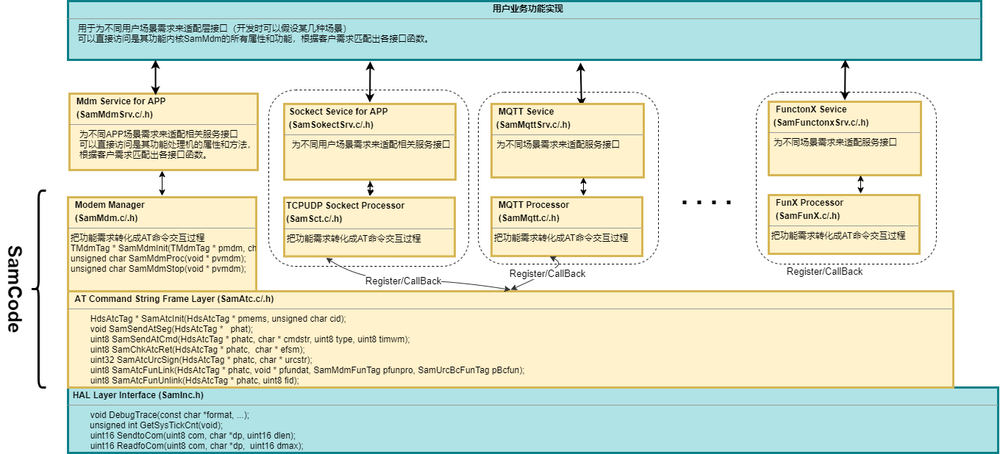

- [English](README.md)  
- [简体中文](README_cn.md)

<h1 style="text-align:center">SAM_ATCDRV</h1>

SAM_ATCDRV(SIMCom Application Module: AT Commands Driver) 是基于SIMCOM无线模块ATC接口来开发各类应用功能的驱动源码库，以供SIMCom客户软件工程师对模块ATC编程参考使用。
本项目是一个通过串口收发AT命令控制SIMCOM蜂窝无线模组的测试程序，实现模组初始化配置、网络注册、状态监测及维护等功能。通过状态机管理模组生命周期，封装AT命令收发逻辑，提供上层服务接口。  
有关SIMCOM蜂窝模块的产品信息，请访问SIMCOM公司网站[SIMCom Website](https://en.simcom.com/module).  如需相关技术支持，请发邮件联系[support@simcom.com](support@simcom.com).  

SAM_ATCDRV源码库主要是为资源受限MCU编写，不依赖RTOS系统支持，整个代码包作为个状态机在嵌入到一个单循环中运行。
是一套简洁灵活，易于扩展应用功能的代码框架，在代码实现上尽量减少对资源的占用，同时也便于配置扩展应用功能。  
以下内容是SAM_ATCDRV源码库的相关主题点的介绍：

- [SAM_ATCDRV的软件框架和移植要求](#sam_atcdrv的软件框架和移植要求)  
- [SAM_ATCDRV的AT命令帧处理层](#sam_atcdrv的at命令帧处理层)  
- [SAM_ATCDRV的MODEM状态维护处理机](#sam_atcdrv的modem状态维护处理机)  
- [SAM_ATCDRV的应用功能SOKECT处理单元](_htmresc/SAM_ATCDRV的应用功能Socket处理单元.md)  
- [SAM_ATCDRV的应用功能MQTT处理单元](_htmresc/SAM_ATCDRV的应用功能MQTT处理单元.md)  
- [SAM_ATCDRV的应用功能TTS处理单元](_htmresc/SAM_ATCDRV的应用功能TTS处理单元.md)  
- [SAM_ATCDRV的应用功能AUDIO处理单元](_htmresc/SAM_ATCDRV的应用功能AUDIO处理单元.md)  
- [SAM_ATCDRV的应用功能FOTA处理单元](_htmresc/SAM_ATCDRV的应用功能FOTA处理单元.md)

## SAM_ATCDRV的软件框架和移植要求
以下是SAM_ATCDRV源码库的框图如下，目前该源码库主要实现：AT命令帧交互，MODEM状态维护，以及相关业务功能(已有TCP/UDP, MQTT, TTS, AUDIO等)陆续补充中。

### step1 从框图中可见，移植该库时首先需要实现以下函数：

函 	  数 | extern void DebugTrace(const char *format, ...);
|---|---|
功    能 | 调试信息打印函数
说    明 | 格式化输出调试信息，支持可变参数，用于跟踪程序运行状态跟踪和问题定位
参    数 | format - 格式化字符串（同printf），包含占位符（如%s、%d等）
参    数 | ... - 可变参数列表，对应格式化字符串中的占位符
返 回 值 | 无
示    例 | DebugTrace("Send AT command: %s\r\n", cmd);

函    名 | extern unsigned int GetSysTickCnt(void);
|---|---|
功    能 | 获取系统滴答计数（毫秒级）
说	  明 | 封装系统 API 获取当前系统运行时间，返回从系统启动到当前的毫秒数，用于计时和延时判断
参    数 | 无
返 回 值 | 系统滴答计数（unsigned int），单位为毫秒
示    例 | unsigned int now = GetSysTickCnt (); // 获取当前系统时间戳

函    数 | extern unsigned short SendtoCom(unsigned char com, char *dp, unsigned short dlen);
|---|---|
功    能 | 向指定串口发送数据
说    明 | 底层串口发送接口，负责将数据通过硬件串口发送给模组（非阻塞）
参    数 |  com  - 串口ID（如1、2等，对应不同物理串口）
参    数 |  dp   - 指向待发送数据的缓冲区指针 
参    数 |  dlen - 要发送的数据长度（字节数）
返 回 值 | 实际发送的字节数（unsigned short）
示    例 | SendtoCom(1, "AT+CSQ\r", 6);  // 向串口1发送信号查询命令

函    数 | extern unsigned short ReadfoCom(unsigned char com, char *dp,  unsigned short dmax);
|---|---|
功    能 | 从指定串口读取数据
说    明 | 底层串口接收接口，从硬件串口读取模组返回的数据（非阻塞）
参    数 |  com  - 串口ID（如1、2等，对应不同物理串口）
参    数 |  dp   - 存储读取数据的缓冲区指针
参    数 |  dmax - 最大可读取的字节数（防止缓冲区溢出）
返 回 值 | 实际读取的字节数（unsigned short）
示    例 | ReadfoCom(1, recv_buf, 128);  // 从串口1读取最多128字节数据

函 数 名 | extern unsigned short ReadfoCom(unsigned char com, char *dp,  unsigned short dmax);
|-----|-----|
功    能 | 从指定串口读取数据
说    明 | 底层串口接收接口，从硬件串口读取模组返回的数据（非阻塞）
参    数 |  com  - 串口ID（如1、2等，对应不同物理串口）
参    数 |  dp   - 存储读取数据的缓冲区指针 
参    数 |  dmax - 最大可读取的字节数（防止缓冲区溢出）
返 回 值 | 实际读取的字节数（unsigned short）
示    例 | ReadfoCom(0, recv_buf, 128);  // 从串口0读取最多128字节数据

### step2  搭建MODEM状态维护机运行框架，推荐代码实现上如下：
~~~c
   ...
    CustomerBoardInit();
	TesterInit( );
	while(1)
	{
		TesterProc();
	}
   ...
~~~
   

## SAM_ATCDRV的AT命令帧处理层

| 函 数 | extern uint8 SamSendAtCmd(HdsAtcTag * phatc, char * cmdstr, uint8 type, uint8 timwm); |
|---|---|
| 功 能 | 发送AT命令到模组 |
| 说 明 | 封装AT命令发送逻辑，将命令写入指定AT通道的发送缓冲区，设置超时参数并启动发送流程，支持带延迟的命令序列 |
| 参 数 | phatc - 指向AT命令通道结构体（HdsAtcTag）的指针，包含通道状态和缓冲信息 |
| 参 数 | cmdstr - 要发送的AT命令字符串（如"AT+CSQ\r"） |
| 参 数 | type - 命令类型标志（如CRLF_HATCTYP表示命令带回车换行结尾） |
| 参 数 | timwm - 等待响应的超时时间（单位：1024ms，0表示不等待响应） |
| 返 回 值 | uint8 - 1（RETCHAR_TRUE）表示发送成功，0（RETCHAR_FALSE）表示发送失败 |
| 示 例 | SamSendAtCmd(pAtc, "AT+CFUN=1\r", CRLF_HATCTYP, 5);  // 发送激活模组命令，超时5*1024ms |

| 函 数 | extern uint8 SamChkAtcRet(HdsAtcTag * phatc, char * efsm); |
|---|---|
| 功 能 | 检查AT命令响应并处理URC |
| 说 明 | 从指定AT通道读取模组返回的数据，匹配预期响应（如"OK"、"ERROR"），同时处理未请求结果码（URC）并广播给注册的回调函数 |
| 参 数 | phatc - 指向AT命令通道结构体的指针 |
| 参 数 | efsm - 预期响应字符串（用\t分隔多个可能的响应，如"OK\r\n\tERROR\r\n"） |
| 返 回 值 | uint8 - 匹配的响应索引（1、2...）；OVERTIME_ATCRET表示超时；NOSTRRET_ATCRET表示未匹配 |
| 示 例 | uint8 ret = SamChkAtcRet(pAtc, "OK\r\n\tERROR\r\n");  // 检查命令响应是否为OK或ERROR |

| 函 数 | extern uint8 SamAtcFunLink(HdsAtcTag * phatc, void * pfundat, SamMdmFunTag pfunpro, SamUrcBcFunTag pBcfun); |
|---|---|
| 功 能 | 注册功能模块到AT命令通道 |
| 说 明 | 将功能模块与AT通道关联，使模块能接收URC（未请求结果码）广播并执行相应处理，实现模块化的AT响应处理 |
| 参 数 | phatc - 指向AT命令通道结构体的指针 |
| 参 数 | pfundat - 功能模块的数据指针（传递给回调函数的上下文） |
| 参 数 | pfunpro - 功能模块的主处理函数指针 |
| 参 数 | pBcfun - 功能模块的URC广播回调函数指针 |
| 返 回 值 | uint8 - 注册的功能ID（0~MDMFUNARRAY_MAX-1）；MDMFUNARRAY_MAX表示注册失败 |
| 示 例 | uint8 fid = SamAtcFunLink(pAtc, pModuleData, ModuleProc, ModuleUrcCb);  // 注册模块到AT通道 |

| 函 数 | extern uint8 SamAtcFunUnlink(HdsAtcTag * phatc, uint8 fid); |
|---|---|
| 功 能 | 从AT命令通道注销功能模块 |
| 说 明 | 解除功能模块与AT通道的关联，释放注册的回调函数和数据指针，停止模块接收URC广播 |
| 参 数 | phatc - 指向AT命令通道结构体的指针 |
| 参 数 | fid - 要注销的功能ID（由SamAtcFunLink返回） |
| 返 回 值 | uint8 - 注销的功能ID；MDMFUNARRAY_MAX表示注销失败（ID无效或未注册） |
| 示 例 | SamAtcFunUnlink(pAtc, fid);  // 从AT通道注销指定功能模块 |

| 函 数 | extern uint8 SamAtcFunUrcBroadCast(HdsAtcTag * phatc, char * notifaction); |
|---|---|
| 功 能 | 向所有注册的功能模块广播URC通知 |
| 说 明 | 遍历AT通道上所有注册的功能模块，调用其URC回调函数并传递URC字符串，实现多模块对模组状态变化的响应 |
| 参 数 | phatc - 指向AT命令通道结构体的指针 |
| 参 数 | notifaction - 要广播的URC字符串（如"+CGEV: ME DETACH"） |
| 返 回 值 | uint8 - 固定返回0（无实际意义） |
| 示 例 | SamAtcFunUrcBroadCast(pAtc, "+SIMCARD: NOT AVAILABLE");  // 广播SIM卡不可用通知 |

| 函 数 | extern uint16 SamAtcDubRead(HdsAtcTag * phatc, uint16 len, char * dp); |
|---|---|
| 功 能 | 从AT命令通道读取指定长度的URC数据 |
| 说 明 | 封装串口读取操作，从AT通道绑定的串口读取指定长度的原始数据（通常用于URC后续数据的补充读取） |
| 参 数 | phatc - 指向AT命令通道结构体的指针 |
| 参 数 | len - 要读取的数据长度（字节） |
| 参 数 | dp - 存储读取数据的缓冲区指针 |
| 返 回 值 | uint16 - 实际读取的字节数 |
| 示 例 | uint16 readLen = SamAtcDubRead(pAtc, 256, urcData);  // 从AT通道读取256字节URC数据 |

## SAM_ATCDRV的MODEM状态维护处理机

| 函 数 | extern TMdmTag * SamMdmInit(TMdmTag * pmdm, char * cfgstr); |
|---|---|
| 功 能 | 初始化Modem结构体 |
| 说 明 | 根据配置字符串初始化Modem核心参数，解析AT通道、命令集类型、PDN配置等信息，绑定AT命令通道和URC回调函数，为Modem运行做准备 |
| 参 数 | pmdm - 指向待初始化的Modem结构体（TMdmTag）的指针 |
| 参 数 | cfgstr - 配置字符串（格式如"\vCFGMDM_A1\t1\tA\t2,1,IP,cmiot,1,,\v"），包含Modem运行所需的参数 |
| 返 回 值 | TMdmTag* - 初始化后的Modem结构体指针；NULL表示初始化失败 |
| 示 例 | TMdmTag mdm; SamMdmInit(&mdm, "\vCFGMDM_A1\t1\tA\t2,1,IP,cmiot,1,,\v");  // 初始化Modem |

| 函 数 | extern unsigned char SamMdmProc(void * pvmdm); |
|---|---|
| 功 能 | Modem主处理函数（状态机驱动） |
| 说 明 | 驱动Modem状态机运行，根据当前状态（初始化、运行、失败等）执行对应操作，包括发送AT命令、处理响应、调度功能模块任务及处理用户自定义AT命令 |
| 参 数 | pvmdm - 指向Modem结构体（TMdmTag）的指针（void*类型便于通用调用） |
| 返 回 值 | unsigned char - 'E'+1表示Modem指针无效；'E'+2表示AT通道无效；RETCHAR_NONE表示正常执行 |
| 示 例 | while (1) { SamMdmProc(pMdm); Sleep(10); }  // 循环驱动Modem状态机 |

| 函 数 | extern unsigned char SamMdmStop(void * pvmdm); |
|---|---|
| 功 能 | 停止Modem运行 |
| 说 明 | 终止Modem状态机运行，重置Modem状态为"无状态"（NONE_MDMSTA），释放相关运行标志，使Modem停止处理任务和响应命令 |
| 参 数 | pvmdm - 指向Modem结构体（TMdmTag）的指针 |
| 返 回 值 | unsigned char - 固定返回RETCHAR_NONE |
| 示 例 | SamMdmStop(pMdm);  // 停止Modem运行 |

| 函 数 | extern unsigned char SamMdmUrcCbfun(void * pvmdm, char * urcstr); |
|---|---|
| 功 能 | URC（未请求结果码）回调处理函数 |
| 说 明 | 处理模组主动上报的URC信息（如SIM卡状态变化、网络去附着等），更新Modem内部状态标志（如清除SIM卡就绪标志），确保Modem及时响应模组状态变化 |
| 参 数 | pvmdm - 指向Modem结构体（TMdmTag）的指针 |
| 参 数 | urcstr - 接收到的URC字符串（如"+SIMCARD: NOT AVAILABLE"） |
| 返 回 值 | unsigned char - 固定返回RETCHAR_NONE |
| 示 例 | （内部回调，无需手动调用）当模组上报"+CGEV: ME DETACH"时，自动触发该函数更新网络注册状态 |
