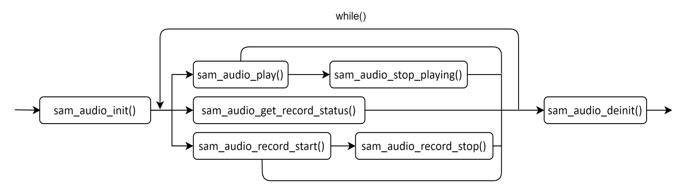

[<- Return to the main directory](../README.md)


# Audio interface instructions V1.00
SIMCom Wireless Solutions Limited  
SIMCom Headquarters Building, Building 3, No. 289  
Linhong Road, Changning District, Shanghai P.R. China  
Tel: 86-21-31575100  
support@simcom.com  
www.simcom.com  

|Document Title|Instructions for using Audio interface|
|---|---|
|Version|V1.01|
|Category|Application Documents|
|Status|Released|

## GENERAL NOTES
SIMCOM OFFERS THIS INFORMATION AS A SERVICE TO ITS CUSTOMERS, TO SUPPORT APPLICATION AND ENGINEERING EFFORTS THAT USE THE PRODUCTS DESIGNED BY SIMCOM. THE INFORMATION PROVIDED IS BASED UPON REQUIREMENTS SPECIFICALLY PROVIDED TO SIMCOM BY THE CUSTOMERS. SIMCOM HAS NOT UNDERTAKEN ANY INDEPENDENT SEARCH FOR ADDITIONAL RELEVANT INFORMATION, INCLUDING ANY INFORMATION THAT MAY BE IN THE CUSTOMERS POSSESSION. FURTHERMORE, SYSTEM VALIDATION OF THIS PRODUCT DESIGNED BY SIMCOM WITHIN A LARGER ELECTRONIC SYSTEM REMAINS THE RESPONSIBILITY OF THE CUSTOMER OR THE CUSTOMERS SYSTEM INTEGRATOR. ALL SPECIFICATIONS SUPPLIED HEREIN ARE SUBJECT TO CHANGE.

# COPYRIGHT
THIS DOCUMENT CONTAINS PROPRIETARY TECHNICAL INFORMATION WHICH IS THE PROPERTY OF SIMCOM WIRELESS SOLUTIONS LIMITED COPYING, TO OTHERS AND USING THIS DOCUMENT, ARE FORBIDDEN WITHOUT EXPRESS AUTHORITY BY SIMCOM. OFFENDERS ARE LIABLE TO THE PAYMENT OF INDEMNIFICATIONS. ALL RIGHTS RESERVED BY SIMCOM IN THE PROPRIETARY TECHNICAL INFORMATION, INCLUDING BUT NOT LIMITED TO REGISTRATION GRANTING OF A PATENT, A UTILITY MODEL OR DESIGN. ALL SPECIFICATION SUPPLIED HEREIN ARE SUBJECT TO CHANGE WITHOUT NOTICE AT ANY TIME.

SIMCom Wireless Solutions Limited  
SIMCom Headquarters Building, Building 3, No. 289 Linhong Road, Changning District, Shanghai P.R. China  
Tel: +86 21 31575100  
Email: simcom@simcom.com  

For more information, please visit:  
https://www.simcom.com/technical_files.html  

For technical support, or to report documentation errors, please visit:  
https://www.simcom.com/online_questions.html or email to: support@simcom.com  

Copyright 漏 2025 SIMCom Wireless Solutions Limited All Rights Reserved.

# Version History
|Version|Date|Author|Description|
|---|---|---|---|
|V1.00|2025-7-23| |Initial version release|

# Document Introduction
This document introduces the interface definition based on VMCU framework Audio, as well as the interface usage method and sample program of Audio, guiding customers on how to call the Audio business of modules (such as A7670SA) on the MCU upper computer to develop Audio related business.

# Contents
- [COPYRIGHT](#copyright)
- [Version History](#version-history)
- [Document Introduction](#document-introduction)
- [Contents](#contents)
- [1 Introduction to Audio API Interface](#1-introduction-to-audio-api-interface)
  - [1.1 Audio function initialization sam_audio_init](#11-audio-function-initialization-sam_audio_init)
  - [1.2 Cancel Audio sam_audio_deinit](#12-cancel-audio-sam_audio_deinit)
  - [1.3 Play an audio file sam_audio_play](#13-play-an-audio-file-sam_audio_play)
  - [1.4 Stop playing Audio sam_audio_stop_playing](#14-stop-playing-audio-sam_audio_stop_playing)
  - [1.5 Obtain the current recording status sam_audio_get_record_status](#15-obtain-the-current-recording-status-sam_audio_get_record_status)
  - [1.6 Used for recording audio files sam_audio_record_start](#16-used-for-recording-audio-files-sam_audio_record_start)
  - [1.7 Stop recording sam_audio_record_stop](#17-stop-recording-sam_audio_record_stop)
- [2 Introduction to Audio interface usage examples](#2-introduction-to-audio-interface-usage-examples)
  - [2.1 Main function entrance](#21-main-function-entrance)
  - [2.2 Record and save to the c:/recording. amr file](#22-record-and-save-to-the-crecording-amr-file)
  - [2.3 Play the recording file](#23-play-the-recording-file)
- [3 Audio function call flowchart](#3-audio-function-call-flowchart)

## 1 Introduction to Audio API Interface
The VMCU framework provides a set of Audio interfaces for processing Audio related services, and recording and playback functions can be achieved through calling the relevant interfaces.

The Audio interface is defined in the header file SamAudio.h and must be included when used.

### 1.1 Audio function initialization sam_audio_init
|Interface|int sam_audio_init(uint8 atcIndex,sam_audio_callback audioCallback,sam_audio_urc_callback urcCallback)|
|---|---|
|Function|The Audio module initialization function, when calling any of the following functions, first needs to register the Audio module in the system. This function only needs to be called once. However, if the Audio module is still needed after calling the void sam_audio_deinit (void) function, this function needs to be called again for initialization.|
|Parameters|atcIndex:Which serial port channel should be selected? Generally, this parameter is passed as 0.<br/>audioCallback:This parameter is passed as a callback function pointer, which returns the execution result of any function from 1.3 to 1.7 when executed.<br/>urcCallback:This parameter passes a pointer to a callback function, which means that when executing any function in 1.3 to 1.7, if the function in 1.3 to 1.7 has a URC report, it will be output through this callback function.|
|Return|0:indicates successful execution.<br/>-1:indicates execution failure. Please check if the correct parameters are passed in.|
|Notes|None|

### 1.2 Cancel Audio sam_audio_deinit
|Interface|int sam_audio_deinit(void);|
|---|---|
|Function|This function is used to log out the Audio module.|
|Parameters|None|
|Return|0:indicates successful execution<br/>-1:indicates that there are other Audio tasks in progress|
|Notes|None|

### 1.3 Play an audio file sam_audio_play
|Interface|int sam_audio_play(char *fileName,uint8 playPath,uint8 repeat);|
|---|---|
|Function|This function is used to play an audio file, which can be in AMR, WAV, MP3, or PCM format. The PCM file must have a header, otherwise it can`t be played.|
|Parameters|fileName:The file name of the audio file that needs to be played, which can include the file path. If there is no file path, it is specified on the C: drive of the module. The maximum length of the file name is 60 bytes.<br/>playPath:0:local path;1:remote path (just support voice call);2:local path and remote path<br/>repeat:0: Don`t play repeatedly, only play once; 1.. 255: The number of times it is played repeatedly.|
|Return|0:indicates successful execution<br/>-1:Please check if the passed parameters are correct.|
|Notes|None|

### 1.4 Stop playing Audio sam_audio_stop_playing
|Interface|int sam_audio_stop_playing(void);|
|---|---|
|Function|Stop audio playback.|
|Parameters|None|
|Return|0:indicates successful execution<br/>-1:indicates that there are other Audio tasks in progress|
|Notes|None|

### 1.5 Obtain the current recording status sam_audio_get_record_status
|Interface|int sam_audio_get_record_status(void)|
|---|---|
|Function|Obtain the current recording status.|
|Parameters|None|
|Return|0:indicates successful execution<br/>-1:indicates that there are other Audio tasks in progress.|
|Notes|None|

### 1.6 Used for recording audio files sam_audio_record_start
|Interface|int sam_audio_record_start(const char *fileName,uint8 recordPath)|
|---|---|
|Function|Used for recording audio files, the file format is WAV or AMR, and the recording will be saved in the C:/directory of the system. The SD card only supports Non ASCII string paths.|
|Parameters|fileName:Save the audio file name of the recording, with a maximum length of 60 bytes. If no file path is entered, the default is C:/directory.<br/>recordPath锛171:local path;2:remote path (get voice from cs call);3:mixd (local and remote).|
|Return|0:indicates successful execution<br/>-1:Please check if the passed parameters are correct.|
|Notes|None|

### 1.7 Stop recording sam_audio_record_stop
|Interface|int sam_audio_record_stop(void)|
|---|---|
|Function|Stop recording.|
|Parameters|None|
|Return|0:indicates successful execution<br/>-1:indicates that there are other Audio tasks in progress|
|Notes|None|

## 2 Introduction to Audio interface usage examples
This chapter mainly introduces how the application calls the Audio interface to achieve Audio playback.

### 2.1 Main function entrance
The initialization of Audio, like the initialization of other modules, calls the sam_audio_init() function in TesterInit() before the while loop.

After initialization, if the application wants to perform Audio related services, such as playing Audio file, it can be executed inside the While loop. Developers can design according to their own logic, and further introduction will be provided in subsequent chapters.

### 2.2 Record and save to the c:/recording. amr file

```c
    sam_audio_record_start("c:/recording.amr",1);
    sam_audio_record_stop();
```

### 2.3 Play the recording file

```c
    sam_audio_play("c:/recording.amr",0,0);
    sam_audio_stop_playing();
```

## 3 Audio function call flowchart



[<- Return to the main directory](../README_en.md)
