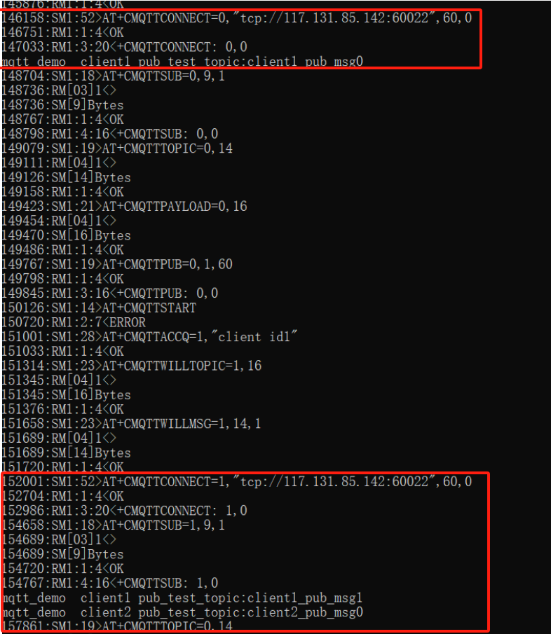
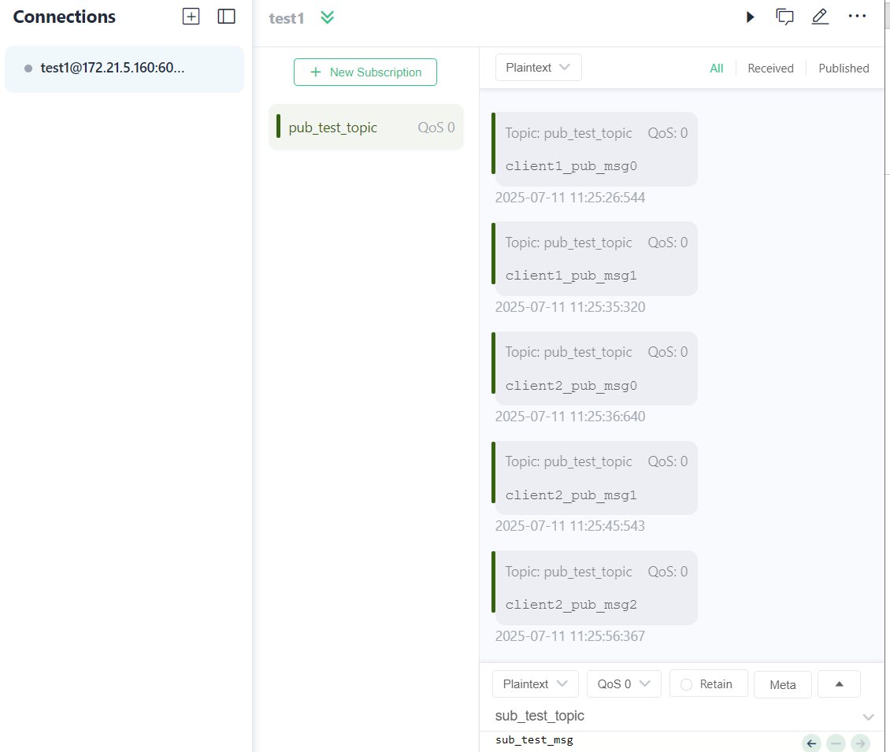
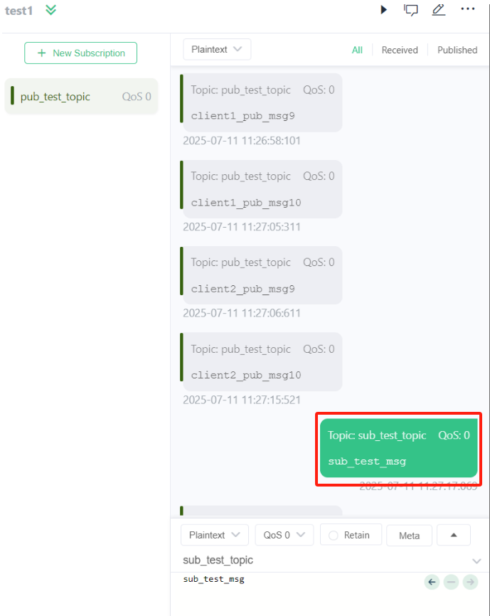
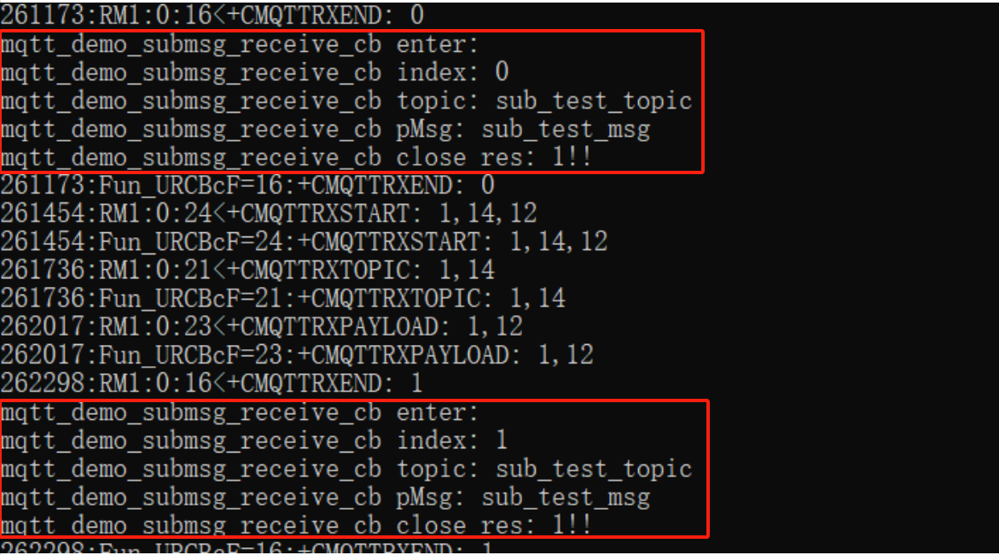

[<- Return to the main directory](../README.md)


# Application Function MQTT Processing Unit of SAM_ATCDRV

LTE Module

SIMCom Wireless Solutions (Shanghai) Co., Ltd.
Building 3, SIMCom Headquarters, No. 289 Linhong Road, Changning District, Shanghai
Tel: 86-21-31575100  
Technical Support Email: [support@simcom.com](https://cn.simcom.com/online_questions.html)  
Official Website: [www.simcom.com](https://www.simcom.com)  

| Name: | MQTT Interface Usage Instructions |
|---|---|
| Version: | V1.01 |
| Category: | Application Document |
| Status: | Published |

# Copyright Notice

This manual contains technical information of SIMCom Wireless Solutions (Shanghai) Co., Ltd. (hereinafter referred to as "SIMCom"). Unless authorized in writing by SIMCom, no unit or individual may extract, copy part or all of the content of this manual without permission, nor may it be disseminated in any form. Violators will be held legally liable. SIMCom reserves all rights regarding intellectual property rights such as patents, utility models, or designs related to the technical information. SIMCom reserves the right to update the specific content of this manual at any time without prior notice.

This manual is copyrighted by SIMCom. Anyone who copies, quotes, or modifies this manual without written consent from our company will bear legal responsibility.

SIMCom Wireless Solutions (Shanghai) Co., Ltd.  
Building 3, SIMCom Headquarters, No. 289 Linhong Road, Changning District, Shanghai  
Tel: 86-21-31575100  
Email: simcom@simcom.com  
Official Website: [www.simcom.com](https://www.simcom.com)  

For more information, please click the following link:  
http://cn.simcom.com/download/list-230-cn.html

For technical support, please click the following link:  
http://cn.simcom.com/ask/index-cn.html or send an email to support@simcom.com

Copyright ? SIMCom Wireless Solutions (Shanghai) Co., Ltd. 2022. All rights reserved.

# Version History

| Version | Date | Author | Remarks |
|---|---|---|---|
| V1.00 | 2025-7-9 |  | First Edition |

# Document Introduction

This document introduces the interface definitions of MQTT based on the VMCU framework, as well as the usage methods and example programs of MQTT interfaces. It guides customers on how to develop MQTT-related services by invoking the MQTT services of modules (such as A7670SA) from the MCU host computer.

# Table of Contents

- [Application Function MQTT Processing Unit of SAM\_ATCDRV](#application-function-mqtt-processing-unit-of-sam_atcdrv)
- [Copyright Notice](#copyright-notice)
- [Version History](#version-history)
- [Document Introduction](#document-introduction)
- [Table of Contents](#table-of-contents)
- [1 MQTT Interface API Introduction](#1-mqtt-interface-api-introduction)
	- [1.1 MQTT Function Initialization sam\_mqtt\_init](#11-mqtt-function-initialization-sam_mqtt_init)
	- [1.2 Subscribe to MQTT Topic sam\_mqtt\_subscribe\_topic](#12-subscribe-to-mqtt-topic-sam_mqtt_subscribe_topic)
	- [1.3 Publish Topic Message sam\_mqtt\_publish\_message](#13-publish-topic-message-sam_mqtt_publish_message)
	- [1.4 Get MQTT Connection Status sam\_mqtt\_get\_connection\_status](#14-get-mqtt-connection-status-sam_mqtt_get_connection_status)
	- [1.5 Register Callback Function sam\_mqtt\_set\_receive\_callback](#15-register-callback-function-sam_mqtt_set_receive_callback)
	- [1.6 Close Current MQTT Connection sam\_mqtt\_close](#16-close-current-mqtt-connection-sam_mqtt_close)
- [2. Introduction to MQTT Interface Usage Examples](#2-introduction-to-mqtt-interface-usage-examples)
	- [2.1 Main Function Entry](#21-main-function-entry)
	- [2.2 MQTT Initialization Example](#22-mqtt-initialization-example)
	- [2.3 MQTT Data Transmission and Reception Examples](#23-mqtt-data-transmission-and-reception-examples)
		- [2.3.1 Example of MQTT Message Subscription and Reception](#231-example-of-mqtt-message-subscription-and-reception)
		- [2.3.2 Example of MQTT Message Publishing](#232-example-of-mqtt-message-publishing)
- [3. Demonstration of MQTT Example Running Results](#3-demonstration-of-mqtt-example-running-results)

# 1 MQTT Interface API Introduction

The VMCU framework provides a set of MQTT interfaces for handling MQTT data transmission and reception services, enabling subscription and publication of MQTT messages.

The MQTT interface definitions are located in the header file `SamMqtt.h`, which must be included when using these interfaces.

All parameters in the following interfaces require a pointer to `TMqttTag`, which points to an MQTT client instance, indicating that the current interface is targeting the current client object.

## 1.1 MQTT Function Initialization sam_mqtt_init

| Interface | `void * sam_mqtt_init(TMqttTag * pmqtt, char * cfgstr);` |
|---|---|
| Function | Initializes an MQTT client instance using a configuration string. Parses configuration parameters from the formatted string, initializes the MQTT context, and sets up the communication channel for MQTT operations. The configuration string should include parameters such as client ID, server address, topics, and communication settings. |
| Parameters | `pmqtt`: Pointer to the MQTT client structure to be initialized.<br>`cfgstr`: Configuration string containing preformatted MQTT parameters. |
| Return Value | Returns a pointer to the initialized MQTT client structure (same as the input parameter).<br>Returns `NULL` if initialization fails (invalid parameters or context initialization error). |
| Remarks | Example configuration string: `"\vCFGMQTT_C%d\t%d\t%d\t\"%[^\"]\"\t\"%[^\"]\"\t\"%[^\"]\"\t\"%[^\"]\"\t\"%[^\"]\"\v"`<br>The parameters in sequence are:<br>Configuration index, AT channel, client index, client ID, server address, subscription topic, will topic, will message.<br>For example:<br>`"\vCFGMQTT_C1\t0\t0\t\"client id0\"\t\"tcp://117.131.85.142:60022\"\t\"cmd_topic\"\t\"will_topic_test0\"\t\"will_msg_test0\"\v"` |

## 1.2 Subscribe to MQTT Topic sam_mqtt_subscribe_topic

| Interface | `uint8 sam_mqtt_subscribe_topic(TMqttTag * pmqtt, char *pTopic);` |
|---|---|
| Function | Subscribes to an MQTT topic by adding the specified topic to the MQTT context for subscription. |
| Parameters | `pmqtt`: Pointer to the MQTT client structure (`TMqttTag`).<br>`pTopic`: Pointer to a null-terminated string representing the topic to subscribe to. |
| Return Value | Return value indicates the subscription status:<br>`1`: Subscription topic added successfully.<br>`0`: Failure (invalid input or topic already subscribed). |
| Remarks | If the return value is `0` when subscribing to a topic, the subscription fails. To retry, the interface must be called again. |

## 1.3 Publish Topic Message sam_mqtt_publish_message

| Interface | `uint8 sam_mqtt_publish_message(TMqttTag * pmqtt, char *pTopic, char *pMsg);` |
|---|---|
| Function | Publishes an MQTT message by adding it to the publish queue. |
| Parameters | `pmqtt`: Pointer to the MQTT client structure (`TMqttTag`).<br>`pTopic`: Pointer to a null-terminated string representing the publish topic.<br>`pMsg`: Pointer to a null-terminated string representing the message payload. |
| Return Value | Return value indicates the operation status:<br>`1`: Message successfully added to the publish queue.<br>`0`: Failure. |
| Remarks | This interface adds the message to the publish queue. Actual message transmission is performed asynchronously through the MQTT processing loop. |

## 1.4 Get MQTT Connection Status sam_mqtt_get_connection_status

| Interface | `uint8 sam_mqtt_get_connection_status(TMqttTag * pmqtt);` |
|---|---|
| Function | Checks the MQTT connection status to determine if the MQTT client is currently connected to the broker. |
| Parameters | `pmqtt`: Pointer to the MQTT client structure (`TMqttTag`). |
| Return Value | `0`: Success.<br>`-1`: Failure. |
| Remarks | None. |

## 1.5 Register Callback Function sam_mqtt_set_receive_callback

| Interface | `void sam_mqtt_set_receive_callback(TMqttTag * pmqtt, sam_mqtt_receive_data_cb cb);` |
|---|---|
| Function | Sets the MQTT message reception callback function, which is used by the client to receive subscribed messages. This function will be invoked when the MQTT client receives a new message. |
| Parameters | `pmqtt`: Pointer to the MQTT client structure (`TMqttTag`)<br>`cb`: Pointer to a callback function of type `sam_mqtt_receive_data_cb` |
| Return Value | None |
| NOTE | 1. The callback function type is defined as follows:<br>`typedef void (* sam_mqtt_receive_data_cb)(struct TMqttTag * pmqtt, uint8 index, char *topic, char *pMsg);`<br>2. Calling this registration function will overwrite any previously set callback function. |

## 1.6 Close Current MQTT Connection sam_mqtt_close

| Interface | `uint8 sam_mqtt_close(TMqttTag * pvmqtt);` |
|---|---|
| Function | Requests to close the MQTT connection. It initiates the disconnection process from the MQTT broker by setting the close request flag in the MQTT client structure. |
| Parameters | `pvmqtt`: Pointer to the MQTT client structure (`TMqttTag`) |
| Return Value | Type: `uint8`. The return value indicates the operation status:<br>`1` - Connection close request initiated successfully<br>`0` - Failure (client is not connected or input parameter is invalid) |
| NOTE | None |

# 2. Introduction to MQTT Interface Usage Examples

This chapter mainly introduces how application programs can call MQTT interface APIs for data transmission and reception. The application program first initializes MQTT through interface calls in the main function, and then invokes interfaces to perform data transmission and reception services.

The initialization of MQTT mainly includes the initialization of contents such as AT channel, client index, client ID, server address, initial subscription topic, will topic, will message, etc.

The MQTT data transmission and reception services mainly include subscription, publication, and reception of MQTT messages, etc.

## 2.1 Main Function Entry

The initialization of MQTT, like that of other modules, is called in `TesterInit()` before the `while` loop (Please refer to the following two code snippets.), with the corresponding API interface being `mqtt_demo_init`. After MQTT initialization, the MQTT client will initiate an MQTT connection based on information such as the server address and client ID provided in the initialization configuration string. Meanwhile, it will configure the will message and the initially subscribed topic. The connection status between the client and MQTT can be determined using `sam_mqtt_get_connection_status`; refer to Section 1.4 for details.
```c
int main(void)
{
    uint8 KeepRun;
    
 	printf("Begin Running VMCU Tester. %s %s\r\n",__DATE__, __TIME__);
 	
#ifdef WIN_COM_SELECT
	Win32_COM_Select();

 	if(SysInitUart(PortNumUsed, 115200) == RETCHAR_FALSE)
 	{
 		return(0);	
 	}
#else
	if(SysInitUart(ATC_COM, 115200) == RETCHAR_FALSE)
	{
		return(0);	
	}
#endif
	
	InitCom(UART_TA);
	TesterInit( ); // Initialization of each module
	CmdBp = 0;
	KeepRun = 0xFF;
	while(KeepRun)
	{
		ComDrvPoll( );
		
		TesterProc( ); //Instance calls for each module
		
		if(CmdBp > 3)
		{
			if(Strsearch(KeyBuffer, "STOP") == 1)
			{
				break;
			}
			else if(Strsearch(KeyBuffer, "DBG:") == 1)
			{
				
			}
		}
		Sleep(5);
	}
    
    CloseHandle(hSerial);
    return 0;
}

```
MQTT demo initialization:
```c
void TesterInit(void)
{
    SamMdmSrvStart( );

#ifdef SAM_SOCKET_TEST
    newTcpClient(0, "117.131.85.142", 60044);
#endif /* SAM_SOCKET_TEST */
#ifdef SAM_MQTT_TEST
    mqtt_demo_init();  //Initialization of the MQTT demo
#endif
#ifdef SAM_TTS_TEST
    sam_demo_tts_init();
#endif
#ifdef SAM_AUDIO_TEST
    sam_demo_audio_init();
#endif
#ifdef SAM_FOTA_TEST
//    fotaStart1(1, "47.109.101.196:5050/SIMTEST/hjy/test2.bin", "SIMCOM", "simcom");
#endif /* SAM_FOTA_TEST */
	
}
```
After initialization, if the application intends to perform MQTT-related operations, such as publishing messages, subscribing to messages, or receiving messages, these can be executed within the `while` loop body, and developers can design them according to their own logic. The reference example program is uniformly placed inside the `TesterProc` function. For the MQTT example, refer to the implementation of `mqtt_demo_client_run` (Refer to the following code snippets).

MQTT data transceiver example:
```c
void TesterProc(void)
{    
    SamMdmSevice( );    

#ifdef SAM_SOCKET_TEST
    testTcpClient();
#endif /* SAM_SOCKET_TEST */

#ifdef SAM_MQTT_TEST
    mqtt_demo_client_run();  //MQTT demo data transmission and reception example
#endif
#ifdef SAM_TTS_TEST
    sam_demo_tts_proc();
#endif
#ifdef SAM_AUDIO_TEST
    sam_demo_audio_proc();
#endif

}

```

## 2.2 MQTT Initialization Example

For the MQTT initialization example, refer to the implementation of the `mqtt_demo_init` function in `SamMqttSrv.c`. It mainly initializes the MQTT client object based on the configuration string, using the API interface `sam_mqtt_init` which returns a pointer to the MQTT client object. The purpose of initialization is to create one or more available MQTT client instances. All subsequent MQTT interface operations are performed on a specific MQTT client. The current example supports 2 MQTT clients running simultaneously.

Implementation of `mqtt_demo_init` function, initialization of client1 and client2:
```c
/**
 * @brief Initialization of MQTT Mode.
 */
void mqtt_demo_init(void)
{
	TMqttTag *pmqtt = NULL;
	printf("mqtt_demo sam_mqtt_init enter\n");
	pmqtt = (TMqttTag *) malloc(sizeof(TMqttTag));
	if(pmqtt != NULL)
	{
		//pMqttClient1 = sam_mqtt_init(pmqtt, &init_mqtt_cfg1);//Mqtt1605CfgStr1
		pMqttClient1 = sam_mqtt_init(pmqtt, Mqtt1605CfgStr1);//Mqtt1605CfgStr1
		if(pMqttClient1 == NULL)
		{
			printf("sam_mqtt_init pMqttClient1 Fail\n");
			free(pmqtt);	
			pmqtt = NULL;	
		}
	}
	else
	{
		printf("malloc Fail:%s,%d\n", __FILE__, __LINE__);
	}
	
	pmqtt = (TMqttTag *) malloc(sizeof(TMqttTag));
	if(pmqtt != NULL)
	{
		//pMqttClient2 = sam_mqtt_init(pmqtt, &init_mqtt_cfg2);
		pMqttClient2 = sam_mqtt_init(pmqtt, Mqtt1605CfgStr2);
		if(pMqttClient2 == NULL)
		{
			printf("sam_mqtt_init pMqttClient2 Fail\n");
			free(pmqtt);	
			pmqtt = NULL;	
		}
	}
	else
	{
		printf("malloc Fail:%s,%d\n", __FILE__, __LINE__);
	}

}

```

Pay special attention to the format of the configuration string required for MQTT client initialization, which corresponds to the second parameter of the `sam_mqtt_init` interface.

The comments of the `sam_mqtt_init` interface also provide detailed explanations. It starts with "\v" and ends with "\v", with each field in the middle separated by the "\t" character, corresponding to config index, AT channel, client index, client ID, server address, subscription topic, will topic, will message. Take the following configuration as an example:

```c
@brief Initialization Configuration for MQTT Client 1.
char Mqtt1605CfgStr1[] ="\vCFGMQTT_C1\t0\t0\t\"client id0\"\t\"tcp://117.131.85.142:60022\"\t\"cmd_ topic\"\t\"will_topic_test0\"\t\"will_msg_test0\"\v";
void *pMqttClient1 = NULL;
```
The parsed values of each field are as follows:

- config index is 1, used as the identifier for the current configuration string;
- at channel is 0, specifying which AT channel the current MQTT client uses to communicate with the module. Since all interface functions are ultimately implemented via AT commands, a channel number must be configured. Currently, there is only one default AT channel;
- client index is 0, corresponding to mqttclient1 in the example. This value ranges from 0 to 1;
- Client id is "client id0". Note that double quotes must be escaped;
- server address is: "tcp://117.131.85.142:60022". Similarly, double quotes must be escaped. 117.131.85.142 is the MQTT server address, and 60022 is the port number. Applications can configure these as needed;
- subscription topic is "cmd_topic", initializing a subscription to messages with the cmd_topic. Applications can pre-configure a subscription topic during initialization, and the MQTT client will automatically subscribe to this topic after connecting to the server;
- will topic is "will_topic_test0", the MQTT will message topic;
- will message is "will_msg_test0", the content of the MQTT will message.

**Remarks**:

All configurations need to be converted into AT commands by the MQTT functional module kernel, so they are implemented asynchronously. However, applications do not need to concern themselves with the internal implementation mechanism and only need to configure the parameters.

The configuration of the above string can be functionally extended as business requirements change.

If the application only requires one client, only one client needs to be initialized.

## 2.3 MQTT Data Transmission and Reception Examples

Once the MQTT client is initialized, operations such as subscribing to MQTT topics, publishing messages, and receiving data can be performed. As described above, the `mqtt_demo_client_run` function in `SamMqttSrv.c` provides a simple example of data transmission and reception. Applications can use this as a reference to design their own MQTT applications according to their specific business logic.

The `mqtt_demo_client_run` function primarily includes three parts:

1. **Subscription to MQTT Topics**: Each client subscribes to a topic named "sub_test_topic".
2. **Callback Function Registration**: A callback function `mqtt_demo_submsg_receive_cb` is registered for each client to handle received messages.
3. **Message Publishing**: Each client publishes messages at 10-second intervals.

### 2.3.1 Example of MQTT Message Subscription and Reception

Refer to the function `mqtt_demo_client_run`. Call `sam_mqtt_set_receive_callback` to set a callback function for receiving subscribed data; for the function prototype and callback function type, please refer to Section 1.5. Call `sam_mqtt_subscribe_topic` to subscribe to a topic; for the function prototype, please refer to Section 1.2. It should be noted that the setup of the callback function and the subscription to topic messages only need to be executed once. Since the entire logic runs in a `while` loop, certain restrictions need to be applied here. Additionally, it is necessary to check whether the current connection status between MQTT and the server is normal.

<br/>

MQTT topic subscription and message reception:
```c
TMqttTag *pclient1 = (TMqttTag *)pMqttClient1;
TMqttTag *pclient2 = (TMqttTag *)pMqttClient2;

// Set receive callback for client1 once connected (only once)
if(NULL != pclient1 && 0 == c1_sub_cb_set_flag && 1 == sam_mqtt_get_connection_status(pclient1))
{
	 sam_mqtt_set_receive_callback(pclient1, mqtt_demo_submsg_receive_cb);
	 c1_sub_cb_set_flag = 1;
}

// Set receive callback for client2 once connected (only once)
if(NULL != pclient2 && 0 == c2_sub_cb_set_flag && 1 == sam_mqtt_get_connection_status(pclient2))
{
	 sam_mqtt_set_receive_callback(pclient2, mqtt_demo_submsg_receive_cb);
	 c2_sub_cb_set_flag = 1;
}	

// Subscribe client1 to test topic once connected (only once)
if(NULL != pclient1 && 0 == c1_sub_flag && 1 == sam_mqtt_get_connection_status(pclient1))
{
	 sam_mqtt_subscribe_topic(pclient1, "sub_test_topic");
	 c1_sub_flag = 1;
}

// Subscribe client2 to test topic once connected (only once)
if(NULL != pclient2 && 0 == c2_sub_flag && 1 == sam_mqtt_get_connection_status(pclient2))
{
	 sam_mqtt_subscribe_topic(pclient2, "sub_test_topic");
	 c2_sub_flag = 1;
}	
```

The following is an example of a callback function. After MQTT receives a subscribed message, it can perform corresponding processing according to the application's business needs. In the example, the received data is simply printed out, and upon receiving a message with the topic "sub_test_topic", a `close` operation is performed on the current client by calling the API interface `sam_mqtt_close`. After closing, the MQTT client actively disconnects from the MQTT server, indicating that the services of the current MQTT client are no longer needed. The `index` parameter can be used to distinguish which client received the subscribed message. The `pmqttobj` parameter is a pointer to the MQTT client object that received the subscribed message; this pointer is required as a parameter for subsequent MQTT message transceiving or other business operations.

<br/>

Implementation of MQTT message reception callback function:
```c
void mqtt_demo_submsg_receive_cb(TMqttTag *pmqttobj, uint8 index, char *topic, char *pMsg)
{
	if(NULL == pmqttobj)
	{
		printf("mqtt_demo_submsg_receive_cb  pmqttobj is NULL!! \r\n");
		return;
	}

    printf("mqtt_demo_submsg_receive_cb enter: \r\n");
    printf("mqtt_demo_submsg_receive_cb index: %u\r\n", index);
    printf("mqtt_demo_submsg_receive_cb topic: %s\r\n", topic);
    printf("mqtt_demo_submsg_receive_cb pMsg: %s\r\n", pMsg);

	 if((NULL != topic) && (0 ==  strcmp(topic, "sub_test_topic")))
	 {
	 	uint8 res = sam_mqtt_close(pmqttobj);
		printf("mqtt_demo_submsg_receive_cb close res: %u!!\r\n", res);
	 }
}
```

**Note**: In the case of multiple clients, the same callback function or different callback functions can be registered.

### 2.3.2 Example of MQTT Message Publishing

Refer to the function `mqtt_demo_client_run` and call `sam_mqtt_publish_message` to publish messages. For the function prototype, please refer to Section 1.3. In the example, each client publishes a message every 10 seconds. For the convenience of debugging and verification, the content of the published message includes the current client identifier and the message index. If another client subscribes to this topic (which is "pub_test_topic" in the example), it will receive the corresponding message approximately every 10 seconds.

<br/>

MQTT message publishing:
```c
// Every 10 seconds, publish messages and check publication limits
	if(stim >= 10)
	{
	    if(NULL != pclient1 && 1 == sam_mqtt_get_connection_status(pclient1))
    	{
			char pub_msg[30] = {0};
		    sprintf(pub_msg, "client1_pub_msg%u", c1_pub_cnt);
			sam_mqtt_publish_message(pclient1, "pub_test_topic", pub_msg);// Client1 publishes a message.
			printf("mqtt_demo  client1 pub_test_topic:%s \r\n",pub_msg);

			c1_pub_cnt ++;
			if(c1_pub_cnt > 1000)
			{
				c1_pub_cnt = 0;
			}
    	}

	    if(NULL != pclient2 && 1 == sam_mqtt_get_connection_status(pclient2))
    	{
			char pub_msg[30] = {0};
		    sprintf(pub_msg, "client2_pub_msg%u", c2_pub_cnt);
			sam_mqtt_publish_message(pclient2, "pub_test_topic", pub_msg);// Client2 publishes a message.
			printf("mqtt_demo  client2 pub_test_topic:%s \r\n",pub_msg);
			c2_pub_cnt ++;
			if(c2_pub_cnt > 1000)
			{
				c2_pub_cnt = 0;
			}
    	}
		stim = 0;
	}
```

**Note**: It should be noted that this only sends a request to publish a message to the MQTT kernel implementation, and the final implementation is achieved by calling AT commands to the module, with an asynchronous mechanism. The time interval here is also the interval at which the application sends the publish request. The interval at which the client subscribing to this message receives the message may not be strictly 10 seconds.

# 3. Demonstration of MQTT Example Running Results

Prerequisites for verifying the example running results:

1. Configure the MQTT server properly, ensure the server is running normally, and set the server address and port number in the MQTT initialization string.
2. Prepare another MQTT client capable of sending and receiving data, connect it to the same server, and subscribe to the "pub_test_topic" topic in advance. The following demonstration uses the MQTTX tool.

After compiling and running, it can be seen from the log that the client starts publishing messages after a successful connection (refer to Figure 1). The MQTTX client tool continuously receives messages published by mqttclient1 and mqttclient2 at intervals of approximately 10 seconds or more (refer to Figure 2). The MQTTX client publishes a message with the topic "sub_test_topic" (refer to Figure 3), and after receiving it, mqttclient1 and mqttclient2 print the message and execute the close operation (refer to Figure 4).

<br/>
Figure 1: MQTT client starts publishing messages after successful connection:
<br/>
<br/>



<br/>
Figure 2: MQTTX client tool receives messages published by mqttclient1 and mqttclient2:
<br/>
<br/>



<br/>
Figure 3: MQTTX client publishes a message with the topic "sub_test_topic":
<br/>
<br/>



<br/>
Figure 4: mqttclient1 and mqttclient2 receive the subscribed message with the topic "sub_test_topic":
<br/>
<br/>


[<- Return to the main directory](../README_en.md)
