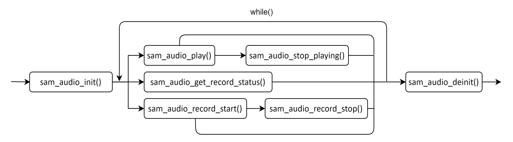

[<- 返回主目录](../README_cn.md)


# Audio接口使用说明V1.00
LTE模组

芯讯通无线科技(上海)有限公司
上海市长宁区临虹路289号3号楼芯讯通总部大楼
电话：86-21-31575100
技术支持邮箱：support@simcom.com
官网：www.simcom.com

|名称：|Audio接口使用说明|
|---|---|
|版本：|V1.01|
|类别：|应用文档|
|状态：|已发布|

# 版权声明

本手册包含芯讯通无线科技（上海）有限公司（简称：芯讯通）的技术信息。除非经芯讯通书面许可，任何单位和个人不得擅自摘抄、复制本手册内容的部分或全部，并不得以任何形式传播，违反者将被追究法律责任。对技术信息涉及的专利、实用新型或者外观设计等知识产权，芯讯通保留一切权利。芯讯通有权在不通知的情况下随时更新本手册的具体内容。

本手册版权属于芯讯通，任何人未经我公司书面同意进行复制、引用或者修改本手册都将承担法律责任。

芯讯通无线科技(上海)有限公司
上海市长宁区临虹路289号3号楼芯讯通总部大楼
电话：86-21-31575100
邮箱：simcom@simcom.com
官网：www.simcom.com

了解更多资料，请点击以下链接：
http://cn.simcom.com/download/list-230-cn.html

技术支持，请点击以下链接：
http://cn.simcom.com/ask/index-cn.html 或发送邮件至support@simcom.com

版权所有 © 芯讯通无线科技(上海)有限公司2022，保留一切权利。

# 版本历史

|版本|日期|作者|备注|
|---|---|---|---|
|V1.00|2025-7-23||第一版|

# 文档介绍

本文档介绍了基于VMCU框架Audio的接口定义，以及Audio的接口使用方法和示例程序，指导客户如何在mcu上位机调用模组（比如A7670SA）的Audio业务开发Audio的相关业务。

# 目录
- [版权声明](#版权声明)
- [版本历史](#版本历史)
- [文档介绍](#文档介绍)
- [目录](#目录)
- [1 Audio 接口 API介绍](#1-audio-接口-api介绍)
  - [1.1 Audio功能初始化sam_audio_init](#11-audio功能初始化sam_audio_init)
  - [1.2 Audio去初始化 sam_audio_deinit](#12-audio去初始化-sam_audio_deinit)
  - [1.3 播放一个音频文件sam_audio_play](#13-播放一个音频文件sam_audio_play)
  - [1.4 停止音频播放sam_audio_stop_playing](#14-停止音频播放sam_audio_stop_playing)
  - [1.5 获取当前录音状态 sam_audio_get_record_status](#15-获取当前录音状态-sam_audio_get_record_status)
  - [1.6 录制音频文件sam_audio_record_start](#16-录制音频文件sam_audio_record_start)
  - [1.7 停止录音sam_audio_record_stop](#17-停止录音sam_audio_record_stop)
- [2 Audio接口使用示例介绍](#2-audio接口使用示例介绍)
  - [2.1 Main函数入口](#21-main函数入口)
  - [2.2 录音并保存到c:/recording.amr文件](#22-录音并保存到crecordingamr文件)
  - [2.3 播放录音文件](#23-播放录音文件)
- [3 Audio函数调用流程图](#3-audio函数调用流程图)

## 1 Audio 接口 API介绍

VMCU框架提供了一组Audio接口，用于处理Audio相关业务，通过相关接口调用可实现录音和播放功能。

Audio接口定义在头文件SamAudio.h中，使用时需包含该文件。

### 1.1 Audio功能初始化sam_audio_init

|接口|int sam_audio_init(uint8 atcIndex,sam_audio_callback audioCallback,sam_audio_urc_callback urcCallback);|
|---|---|
|功能|Audio模块初始化函数，调用以下任意函数时，首先需要将Audio模块注册到系统中。此函数只需要调用一次。但是调用void sam_audio_deinit(void)函数后，如果还需要使用Audio模块，则需要再次调用此函数进行初始化。|
|参数|atcIndex：选用哪一个串口通道，一般将此参数传入0。<br/>audioCallback：此参数传入一个回调函数指针，就是执行1.3至1.7里面的任意函数时，返回1.3至1.7函数的执行结果。<br/>urcCallback：此参数传入一个回调函数的指针，就是执行1.3至1.7里面的任意函数时，如果1.3至1.7里面的函数有URC上报，会通过此回调函数输出。|
|返回值|0：表示执行成功。<br/>-1：表示执行失败，请检查是否传入正确的参数。|
|备注|无|

### 1.2 Audio去初始化 sam_audio_deinit

|接口|int sam_audio_deinit(void);|
|---|---|
|功能|用于注销Audio模块。|
|参数|无|
|返回值|0：表示执行成功。<br/>-1：表示有其他的Audio任务正在执行。|
|备注|无|

### 1.3 播放一个音频文件sam_audio_play

|接口|int sam_audio_play(char *fileName,uint8 playPath,uint8 repeat);|
|---|---|
|功能|用于播放一个音频文件，文件格式可以是AMR、WAV、MP3或PCM，其中PCM文件必须有一个文件头，否则无法播放。|
|参数|fileName：需要播放的音频文件的文件名，可包含文件路径，如果无文件路径，则指定在模块的C:盘，文件名最大长度为60个字节。<br/>playPath：0:local path;1:remote path (just support voice call);2:local path and remote path<br/>repeat： 0:不重复播放，仅播放一次；1..255:重复播放的次数。|
|返回值|0：表示执行成功。<br/>-1：表示执行失败，请检查是否传入正确的参数。|
|备注|无|

### 1.4 停止音频播放sam_audio_stop_playing

|接口|int sam_audio_stop_playing(void);|
|---|---|
|功能|停止音频播放|
|参数|无|
|返回值|0：表示执行成功<br/>-1：表示有其他的Audio任务正在执行|
|备注|无|

### 1.5 获取当前录音状态 sam_audio_get_record_status

|接口|int sam_audio_get_record_status(void);|
|---|---|
|功能|获取当前录音状态。|
|参数|无|
|返回值|0：表示执行成功<br/>-1：表示有其他的Audio任务正在执行|
|备注|无|

### 1.6 录制音频文件sam_audio_record_start

|接口|int sam_audio_record_start(const char *fileName,uint8 recordPath);|
|---|---|
|功能|录制音频文件，文件格式为WAV或AMR，录音会被保存在系统的C:/目录下，SD卡仅支持Non-ASCII字符串路径。|
|参数|fileName：保存录音的音频文件名称，最大长度60个字节，如果没有输入文件路径，默认是C:/目录。<br/>recordPath：1:local path;2:remote path (get voice from cs call);3:mixd (local and remote)。|
|返回值|0：表示执行成功。<br/>-1：请检查传入的参数是否正确。|
|备注|无|

### 1.7 停止录音sam_audio_record_stop

|接口|int sam_audio_record_stop(void);|
|---|---|
|功能|停止录音。|
|参数|无|
|返回值|0：表示执行成功<br/>-1：表示有其他的TTS任务正在执行|
|备注|无|

## 2 Audio接口使用示例介绍

本章节主要介绍应用程序如何调用Audio的接口实现Audio语音的播放和录音。

### 2.1 Main函数入口

Audio的初始化和其他模块的初始化一样，都在while循环之前TesterInit( )里面调用sam_audio_init()函数。

初始化完成后，如果应用想执行Audio的相关业务，比如播放Audio语音，可以在While循环体内部执行，开发者可根据自己的逻辑设计，后续章节会做进一步介绍。

### 2.2 录音并保存到c:/recording.amr文件

```c
    sam_audio_record_start("c:/recording.amr",1);
    sam_audio_record_stop();
```

### 2.3 播放录音文件

```c
    sam_audio_play("c:/recording.amr",0,0);
    sam_audio_stop_playing();
```

## 3 Audio函数调用流程图



[<- 返回主目录](../README_cn.md)
