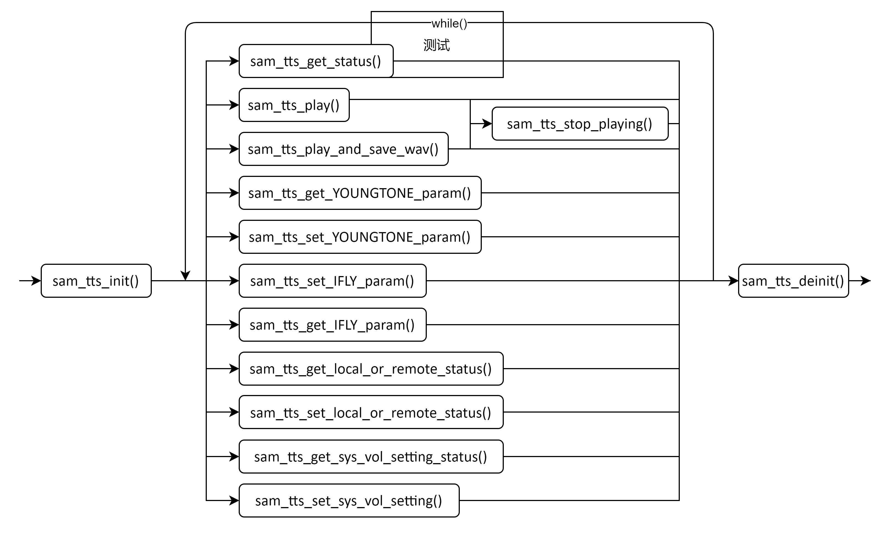

[<- 杩斿洖涓荤洰褰昡(../README_cn.md)


# TTS鎺ュ彛浣跨敤璇存槑V1.00
鑺閫氭棤绾跨鎶(涓婃捣)鏈夐檺鍏徃  
涓婃捣甯傞暱瀹佸尯涓磋櫣璺??289鍙??3鍙锋ゼ鑺閫氭婚儴澶фゼ  
鐢佃瘽锛??86-21-31575100  
鎶鏈敮鎸侀偖绠憋細support@simcom.com  
瀹樼綉锛歸ww.simcom.com

|鍚嶇О锛殀TTS鎺ュ彛浣跨敤璇存槑|
|---|---|
|鐗堟湰锛殀V1.01|
|绫诲埆锛殀搴旂敤鏂囨。|
|鐘舵侊細|宸插彂甯億

# 鐗堟潈澹版槑
鏈墜鍐屽寘鍚姱璁氭棤绾跨鎶锛堜笂娴凤級鏈夐檺鍏徃锛堢畝绉帮細鑺閫氾級鐨勬妧鏈俊鎭傞櫎闈炵粡鑺閫氫功闈㈣鍙紝浠讳綍鍗曚綅鍜屼釜浜轰笉寰楁搮鑷憳鎶勩佸鍒舵湰鎵嬪唽鍐呭鐨勯儴鍒嗘垨鍏ㄩ儴锛屽苟涓嶅緱浠ヤ换浣曞舰寮忎紶鎾紝杩濆弽鑰呭皢琚拷绌舵硶寰嬭矗浠汇傚鎶鏈俊鎭秹鍙婄殑涓撳埄銆佸疄鐢ㄦ柊鍨嬫垨鑰呭瑙傝璁＄瓑鐭ヨ瘑浜ф潈锛岃姱璁氫繚鐣欎竴鍒囨潈鍒┿傝姱璁氭湁鏉冨湪涓嶉氱煡鐨勬儏鍐典笅闅忔椂鏇存柊鏈墜鍐岀殑鍏蜂綋鍐呭銆??

鏈墜鍐岀増鏉冨睘浜庤姱璁氾紝浠讳綍浜烘湭缁忔垜鍏徃涔﹂潰鍚屾剰杩涜澶嶅埗銆佸紩鐢ㄦ垨鑰呬慨鏀规湰鎵嬪唽閮藉皢鎵挎媴娉曞緥璐ｄ换銆??

鑺閫氭棤绾跨鎶(涓婃捣)鏈夐檺鍏徃  
涓婃捣甯傞暱瀹佸尯涓磋櫣璺??289鍙??3鍙锋ゼ鑺閫氭婚儴澶фゼ  
鐢佃瘽锛??86-21-31575100  
閭锛歴imcom@simcom.com  
瀹樼綉锛歸ww.simcom.com

浜嗚В鏇村璧勬枡锛岃鐐瑰嚮浠ヤ笅閾炬帴锛??  
http://cn.simcom.com/download/list-230-cn.html  

鎶鏈敮鎸侊紝璇风偣鍑讳互涓嬮摼鎺ワ細  
http://cn.simcom.com/ask/index-cn.html 鎴栧彂閫侀偖浠惰嚦support@simcom.com  

鐗堟潈鎵鏈?? 漏 鑺閫氭棤绾跨鎶(涓婃捣)鏈夐檺鍏徃2022锛屼繚鐣欎竴鍒囨潈鍒┿??

# 鐗堟湰鍘嗗彶
|鐗堟湰|鏃ユ湡|浣滆厊澶囨敞|
|---|---|---|---|
|V1.00|2025-7-23| |绗竴鐗坾

# 鏂囨。浠嬬粛
鏈枃妗ｄ粙缁嶄簡鍩轰簬VMCU妗嗘灦TTS鐨勬帴鍙ｅ畾涔夛紝浠ュ強TTS鐨勬帴鍙ｄ娇鐢ㄦ柟娉曞拰绀轰緥绋嬪簭锛屾寚瀵煎鎴峰浣曞湪mcu涓婁綅鏈鸿皟鐢ㄦā缁勶紙姣斿A7670SA锛夌殑TTS涓氬姟寮鍙慣TS鐨勭浉鍏充笟鍔°??

# 鐩綍
- [鐗堟潈澹版槑](#鐗堟潈澹版槑)
- [鐗堟湰鍘嗗彶](#鐗堟湰鍘嗗彶)
- [鏂囨。浠嬬粛](#鏂囨。浠嬬粛)
- [鐩綍](#鐩綍)
- [1 TTS 鎺ュ彛 API浠嬬粛](#1-tts-鎺ュ彛-api浠嬬粛)
  - [1.1 TTS鍔熻兘鍒濆鍖杝am_tts_init](#11-tts鍔熻兘鍒濆鍖杝am_tts_init)
  - [1.2 TTS鍘诲垵濮嬪寲 sam_tts_deinit](#12-tts鍘诲垵濮嬪寲-sam_tts_deinit)
  - [1.3 鑾峰彇TTS宸ヤ綔鐘舵乻am_tts_get_status](#13-鑾峰彇tts宸ヤ綔鐘舵乻am_tts_get_status)
  - [1.4 鍋滄TTS鎾斁sam_tts_stop_playing](#14-鍋滄tts鎾斁sam_tts_stop_playing)
  - [1.5 鎾斁TTS璇煶sam_tts_play](#15-鎾斁tts璇煶sam_tts_play)
  - [1.6 鎾斁TTS璇煶骞跺皢鏁版嵁淇濆瓨鍒皐av鏍煎紡鐨勬枃浠朵腑sam_tts_play_and_save_wav](#16-鎾斁tts璇煶骞跺皢鏁版嵁淇濆瓨鍒皐av鏍煎紡鐨勬枃浠朵腑sam_tts_play_and_save_wav)
  - [1.7 鑾峰彇YOUNGTONE TTS搴撶浉鍏崇殑鍙傛暟sam_tts_get_YOUNGTONE_param](#17-鑾峰彇youngtone-tts搴撶浉鍏崇殑鍙傛暟sam_tts_get_youngtone_param)
  - [1.8 璁剧疆YOUNGTONE TTS搴撶浉鍏崇殑鍙傛暟sam_tts_set_YOUNGTONE_param](#18-璁剧疆youngtone-tts搴撶浉鍏崇殑鍙傛暟sam_tts_set_youngtone_param)
  - [1.9 璁剧疆IFLY TTS搴撶浉鍏崇殑鍙傛暟sam_tts_set_IFLY_param](#19-璁剧疆ifly-tts搴撶浉鍏崇殑鍙傛暟sam_tts_set_ifly_param)
  - [1.10 鑾峰彇IFLY TTS搴撶浉鍏崇殑鍙傛暟sam_tts_get_IFLY_param](#110-鑾峰彇ifly-tts搴撶浉鍏崇殑鍙傛暟sam_tts_get_ifly_param)
  - [1.11 鑾峰彇TTS鏄湰绔挱鏀捐繕鏄繙绔挱鏀緎am_tts_get_local_or_remote_status](#111-鑾峰彇tts鏄湰绔挱鏀捐繕鏄繙绔挱鏀緎am_tts_get_local_or_remote_status)
  - [1.12 璁剧疆TTS鏄湰绔挱鏀捐繕鏄繙绔挱鏀緎am_tts_set_local_or_remote_status](#112-璁剧疆tts鏄湰绔挱鏀捐繕鏄繙绔挱鏀緎am_tts_set_local_or_remote_status)
  - [1.13 鑾峰彇绯荤粺闊抽噺鏄惁鍙缃畇am_tts_get_sys_vol_setting_status](#113-鑾峰彇绯荤粺闊抽噺鏄惁鍙缃畇am_tts_get_sys_vol_setting_status)
  - [1.14 璁剧疆绯荤粺闊抽噺鏄惁鍙缃畇am_tts_set_sys_vol_setting10](#114-璁剧疆绯荤粺闊抽噺鏄惁鍙缃畇am_tts_set_sys_vol_setting10)
- [2 TTS鎺ュ彛浣跨敤绀轰緥浠嬬粛](#2-tts鎺ュ彛浣跨敤绀轰緥浠嬬粛)
  - [2.1 Main鍑芥暟鍏ュ彛](#21-main鍑芥暟鍏ュ彛)
  - [2.2 鎾斁UCS2鏁版嵁缂栫爜鏍煎紡鐨凾TS璇煶](#22-鎾斁ucs2鏁版嵁缂栫爜鏍煎紡鐨則ts璇煶)
  - [2.3 鎾斁GBK鏁版嵁鏍煎紡鐨凾TS璇煶](#23-鎾斁gbk鏁版嵁鏍煎紡鐨則ts璇煶)
  - [2.4 鎾斁ASCII缂栫爜鏍煎紡鐨勮闊冲苟淇濆瓨璇煶](#24-鎾斁ascii缂栫爜鏍煎紡鐨勮闊冲苟淇濆瓨璇煶)
  - [2.5 璁剧疆YOUNGTONE TTS搴撳弬鏁癩(#25-璁剧疆youngtone-tts搴撳弬鏁??)
  - [2.6 璁剧疆IFLY TTS搴撳弬鏁癩(#26-璁剧疆ifly-tts搴撳弬鏁??)
- [3 TTS鍑芥暟璋冪敤娴佺▼鍥綸(#3-tts鍑芥暟璋冪敤娴佺▼鍥??)

## 1 TTS 鎺ュ彛 API浠嬬粛
VMCU妗嗘灦鎻愪緵浜嗕竴缁凾TS鎺ュ彛锛岀敤浜庡鐞員TS鐩稿叧涓氬姟锛岄氳繃鐩稿叧鎺ュ彛璋冪敤鍙疄鐜版枃鏈浆鎹负闊抽杈撳嚭鐨勫姛鑳姐??

TTS鎺ュ彛瀹氫箟鍦ㄥご鏂囦欢SamTTS.h涓紝浣跨敤鏃堕渶鍖呭惈璇ユ枃浠躲??

### 1.1 TTS鍔熻兘鍒濆鍖杝am_tts_init
|鎺ュ彛|int sam_tts_init(uint8 atcIndex,sam_tts_callback ttsCallback,sam_tts_urc_callback urcTTSCallback);|
|---|---|
|鍔熻兘|TTS妯″潡鍒濆鍖栧嚱鏁帮紝璋冪敤浠ヤ笅浠绘剰鍑芥暟鏃讹紝棣栧厛闇瑕佸皢TTS妯″潡娉ㄥ唽鍒扮郴缁熶腑銆傛鍑芥暟鍙渶瑕佽皟鐢ㄤ竴娆°備絾鏄皟鐢╲oid sam_tts_deinit(void)鍑芥暟鍚庯紝濡傛灉杩橀渶瑕佷娇鐢═TS妯″潡锛屽垯闇瑕佸啀娆¤皟鐢ㄦ鍑芥暟杩涜鍒濆鍖栥倈
|鍙傛暟|atcIndex锛?? 閫夌敤鍝竴涓覆鍙ｉ氶亾锛屼竴鑸皢姝ゅ弬鏁颁紶鍏??0銆??<br/>ttsCallback锛?? 姝ゅ弬鏁颁紶鍏ヤ竴涓洖璋冨嚱鏁版寚閽堬紝灏辨槸鎵ц1.3鑷??1.14閲岄潰鐨勪换鎰忓嚱鏁版椂锛岃繑鍥??1.3鑷??1.14鍑芥暟鐨勬墽琛岀粨鏋溿??<br/>urcTTSCallback锛?? 姝ゅ弬鏁颁紶鍏ヤ竴涓洖璋冨嚱鏁扮殑鎸囬拡锛屽氨鏄墽琛??3鑷??14閲岄潰鐨勪换鎰忓嚱鏁版椂锛屽鏋??1.3鑷??1.14閲岄潰鐨勫嚱鏁版湁URC涓婃姤锛屼細閫氳繃姝ゅ洖璋冨嚱鏁拌緭鍑恒倈
|杩斿洖鍊紎0锛氳〃绀烘墽琛屾垚鍔熴??<br/>-1锛氳〃绀烘墽琛屽け璐ワ紝璇锋鏌ユ槸鍚︿紶鍏ユ纭殑鍙傛暟銆倈
|澶囨敞|鏃爘

### 1.2 TTS鍘诲垵濮嬪寲 sam_tts_deinit
|鎺ュ彛|void sam_tts_deinit(void);|
|---|---|
|鍔熻兘|鐢ㄤ簬娉ㄩ攢TTS妯″潡銆倈
|鍙傛暟|鏃爘
|杩斿洖鍊紎鏃爘
|澶囨敞|鏃爘

### 1.3 鑾峰彇TTS宸ヤ綔鐘舵乻am_tts_get_status
|鎺ュ彛|int sam_tts_get_status(void);|
|---|---|
|鍔熻兘|姝ゅ嚱鏁扮敤浜庤幏鍙朤TS鐨勫伐浣滅姸鎬侊紝浼氶氳繃鍥炶皟鍑芥暟杩斿洖TTS褰撳墠鐨勭姸鎬佹槸姝ｅ湪鎾斁TTS锛岃繕鏄病鏈夋挱鏀綯TS銆倈
|鍙傛暟|鏃爘
|杩斿洖鍊紎0锛氳〃绀烘墽琛屾垚鍔熴??<br/>-1锛氳〃绀烘湁鍏朵粬鐨凾TS浠诲姟姝ｅ湪鎵ц銆倈
|澶囨敞|鏃爘

### 1.4 鍋滄TTS鎾斁sam_tts_stop_playing
|鎺ュ彛|int sam_tts_stop_playing(void);|
|---|---|
|鍔熻兘|鍋滄TTS鐨勬挱鏀緗
|鍙傛暟|鏃爘
|杩斿洖鍊紎0锛氳〃绀烘墽琛屾垚鍔??<br/>-1锛氳〃绀烘湁鍏朵粬鐨凾TS浠诲姟姝ｅ湪鎵ц|
|澶囨敞|鏃爘

### 1.5 鎾斁TTS璇煶sam_tts_play
|鎺ュ彛|int sam_tts_play(uint8 *pData,uint16 dataSize,TTS_PLAYING_DATA_FORMAT_E format);|
|---|---|
|鍔熻兘|鎾斁TTS璇煶銆倈
|鍙傛暟|pData锛氬鏋滄暟鎹槸ASCII缂栫爜鏍煎紡锛屼腑鏂囨槸GBK缂栫爜鏍煎紡锛屼袱绉嶆牸寮忓崟鐙瓨鍦紝鎴栬呮贩鍚堝瓨鍦紝鏁版嵁鐨勬渶澶ч暱搴︽槸512瀛楄妭锛堝寘鎷袱涓紩鍙凤級锛屽鏋滄槸UCS2缂栫爜鏍煎紡锛屽寘鎷紩鍙峰湪鍐咃紝鏈澶ч暱搴︽槸510瀛楄妭銆??<br/>dataSize锛氫紶鍏ョ殑pData鏁版嵁鐨勯暱搴︺??<br/>format锛歱Data鎵鎸囩殑鏁版嵁鐨勭紪鐮佹牸寮忋倈
|杩斿洖鍊紎0锛氳〃绀烘墽琛屾垚鍔熴??<br/>-1锛氳妫鏌ヤ紶鍏ョ殑鍙傛暟鏄惁姝ｇ‘銆倈
|澶囨敞|鏃爘

### 1.6 鎾斁TTS璇煶骞跺皢鏁版嵁淇濆瓨鍒皐av鏍煎紡鐨勬枃浠朵腑sam_tts_play_and_save_wav
|鎺ュ彛|int sam_tts_play_and_save_wav(uint8 *pData,uint16 dataSize,char *fileName,TTS_PLAYING_DATA_FORMAT_E format);|
|---|---|
|鍔熻兘|鎾斁TTS璇煶骞跺皢鏁版嵁淇濆瓨鍒皐av鏍煎紡鐨勬枃浠朵腑銆倈
|鍙傛暟|pData锛氬鏋滄暟鎹槸ASCII缂栫爜鏍煎紡锛屼腑鏂囨槸GBK缂栫爜鏍煎紡锛屼袱绉嶆牸寮忓崟鐙瓨鍦紝鎴栬呮贩鍚堝瓨鍦紝鏁版嵁鐨勬渶澶ч暱搴︽槸50瀛楄妭銆俆OUNGTONE TTS锛氫腑鏂囧闊冲瓧缂栫爜鏍煎紡锛屽闊冲瓧<pinyin=鍙戦煶璇婚煶+澹拌皟>锛汭FLY TTS锛氫腑鏂囧闊冲瓧缂栫爜鏍煎紡锛屽闊冲瓧[=鍙戦煶璇婚煶+澹拌皟]銆傚鏋滄暟鎹槸UCS2缂栫爜鏁版嵁锛屾暟鎹殑鏈澶ч暱搴︽槸50瀛楄妭銆??<br/>dataSize锛氫紶鍏ョ殑pData鏁版嵁鐨勯暱搴︺??<br/>fileName锛氳緭鍏ヨ矾寰勫拰鏂囦欢鍚嶏紝濡傛灉涓嶆寚瀹氳矾寰勶紝榛樿淇濆瓨鍦–:鐩橈紝鏈澶ф枃浠跺悕闀垮害涓??60瀛楄妭锛屽綋鍓嶄粎浠呮敮鎸??.wav鏂囦欢鍚嶅悗缂銆??<br/>format锛歱Data鎵鎸囩殑鏁版嵁鐨勭紪鐮佹牸寮忋倈
|杩斿洖鍊紎0锛氳〃绀烘墽琛屾垚鍔熴??<br/>-1锛氳妫鏌ヤ紶鍏ョ殑鍙傛暟鏄惁姝ｇ‘銆倈
|澶囨敞|鏃爘

### 1.7 鑾峰彇YOUNGTONE TTS搴撶浉鍏崇殑鍙傛暟sam_tts_get_YOUNGTONE_param
|鎺ュ彛|int sam_tts_get_YOUNGTONE_param(void);|
|---|---|
|鍔熻兘|鑾峰彇YOUNGTONE TTS搴撶浉鍏崇殑鍙傛暟锛屾鍑芥暟浼氶氳繃sam_tts_init璁剧疆鐨勫洖璋冨嚱鏁拌繑鍥炲弬鏁板笺倈
|鍙傛暟|鏃爘
|杩斿洖鍊紎0锛氳〃绀烘墽琛屾垚鍔??<br/>-1锛氳〃绀烘湁鍏朵粬鐨凾TS浠诲姟姝ｅ湪鎵ц|
|澶囨敞|鏃爘

### 1.8 璁剧疆YOUNGTONE TTS搴撶浉鍏崇殑鍙傛暟sam_tts_set_YOUNGTONE_param
|鎺ュ彛|int sam_tts_set_YOUNGTONE_param(TTS_param_T *pParam);|
|---|---|
|鍔熻兘|璁剧疆YOUNGTONE TTS搴撶浉鍏崇殑鍙傛暟銆倈
|鍙傛暟|pParam锛氭槸涓涓猅TS_param_T缁撴瀯浣撴寚閽堬紝缁撴瀯浣撻噷闈㈡槸涓涓暟缁勶細<br/> *  index 0:TTS lib volume,range (0,1,2),default:1.<br/> *  index 1:system volume,range (0,1,2,3),default:3.<br/> *  index 2:digitmode,range (0,1,2),default:0.<br/> *  index 3:pitch,range (0,1,2),default:1.<br/> *  index 4:speed,rough speed regulation,range (0,1,2),default:1;precision speed regulation,range [10...30].<br/>     *  index 5:digitreading,range (0,1),default:0.|
|杩斿洖鍊紎0锛氳〃绀烘墽琛屾垚鍔??<br/>-1锛氳〃绀烘湁鍏朵粬鐨凾TS浠诲姟姝ｅ湪鎵ц|
|澶囨敞|鏃爘

### 1.9 璁剧疆IFLY TTS搴撶浉鍏崇殑鍙傛暟sam_tts_set_IFLY_param
|鎺ュ彛|int sam_tts_set_IFLY_param(TTS_param_T *pParam);|
|---|---|
|鍔熻兘|璁剧疆IFLY TTS搴撶浉鍏崇殑鍙傛暟銆倈
|鍙傛暟|pParam鏄竴涓猅TS_param_T缁撴瀯浣撴寚閽堬紝缁撴瀯浣撻噷闈㈡槸涓涓暟缁勶細<br/> *  index 0:TTS lib volume,range (0,1,2),default:2.<br/> *  index 1:system volume,range (0...7),default:4.<br/> *  index 2:digitmode,range (0,1,2),default:0.<br/> *  index 3:pitch,range (0,1,2),default:1.<br/> *  index 4:speed,rough speed regulation,range (0,1,2),default:1;precision speed regulation,range [10...30].<br/>     *  index 5:ttslib,range (0,1),default:0.|
|杩斿洖鍊紎0锛氳〃绀烘墽琛屾垚鍔??<br/>-1锛氳〃绀烘湁鍏朵粬鐨凾TS浠诲姟姝ｅ湪鎵ц|
|澶囨敞|鏃爘

### 1.10 鑾峰彇IFLY TTS搴撶浉鍏崇殑鍙傛暟sam_tts_get_IFLY_param
|鎺ュ彛|int sam_tts_get_IFLY_param(void);|
|---|---|
|鍔熻兘|鑾峰彇IFLY TTS搴撶浉鍏崇殑鍙傛暟锛屾鍑芥暟浼氶氳繃sam_tts_init璁剧疆鐨勫洖璋冨嚱鏁拌繑鍥炲弬鏁板笺倈
|鍙傛暟|鏃爘
|杩斿洖鍊紎0锛氳〃绀烘墽琛屾垚鍔??<br/>-1锛氳〃绀烘湁鍏朵粬鐨凾TS浠诲姟姝ｅ湪鎵ц|
|澶囨敞|鏃爘

### 1.11 鑾峰彇TTS鏄湰绔挱鏀捐繕鏄繙绔挱鏀緎am_tts_get_local_or_remote_status
|鎺ュ彛|int sam_tts_get_local_or_remote_status(void);|
|---|---|
|鍔熻兘|鑾峰彇TTS鏄湰绔挱鏀捐繕鏄繙绔挱鏀撅紝鑾峰彇鐨勭姸鎬佸奸氳繃sam_tts_init璁剧疆鐨勫洖璋冨嚱鏁拌繑鍥炪倈
|鍙傛暟|鏃爘
|杩斿洖鍊紎0锛氳〃绀烘墽琛屾垚鍔??<br/>-1锛氳〃绀烘湁鍏朵粬鐨凾TS浠诲姟姝ｅ湪鎵ц|
|澶囨敞|鏃爘

### 1.12 璁剧疆TTS鏄湰绔挱鏀捐繕鏄繙绔挱鏀緎am_tts_set_local_or_remote_status
|鎺ュ彛|int sam_tts_set_local_or_remote_status(uint8 localOrRemote);|
|---|---|
|鍔熻兘|璁剧疆TTS鏄湰绔挱鏀捐繕鏄繙绔挱鏀俱倈
|鍙傛暟|localOrRemote锛??0:Local Path,1:Remote Path銆倈
|杩斿洖鍊紎0锛氳〃绀烘墽琛屾垚鍔??<br/>-1锛氳〃绀烘湁鍏朵粬鐨凾TS浠诲姟姝ｅ湪鎵ц|
|澶囨敞|鏃爘

### 1.13 鑾峰彇绯荤粺闊抽噺鏄惁鍙缃畇am_tts_get_sys_vol_setting_status
|鎺ュ彛|int sam_tts_get_sys_vol_setting_status(void);|
|---|---|
|鍔熻兘|鑾峰彇绯荤粺闊抽噺鏄惁鍙缃紝鑾峰彇鐨勭姸鎬佸奸氳繃sam_tts_init璁剧疆鐨勫洖璋冨嚱鏁拌繑鍥炪倈
|鍙傛暟|鏃爘
|杩斿洖鍊紎0锛氳〃绀烘墽琛屾垚鍔??<br/>-1锛氳〃绀烘湁鍏朵粬鐨凾TS浠诲姟姝ｅ湪鎵ц|
|澶囨敞|鏃爘

### 1.14 璁剧疆绯荤粺闊抽噺鏄惁鍙缃畇am_tts_set_sys_vol_setting10
|鎺ュ彛|int sam_tts_set_sys_vol_setting(uint8 sysVolSetting);|
|---|---|
|鍔熻兘|璁剧疆绯荤粺闊抽噺鏄惁鍙缃倈
|鍙傛暟|sysVolSetting锛??0:volume setting is valid,1:volume setting is invalid.|
|杩斿洖鍊紎0锛氳〃绀烘墽琛屾垚鍔??<br/>-1锛氳〃绀烘湁鍏朵粬鐨凾TS浠诲姟姝ｅ湪鎵ц|
|澶囨敞|鏃爘

## 2 TTS鎺ュ彛浣跨敤绀轰緥浠嬬粛
鏈珷鑺備富瑕佷粙缁嶅簲鐢ㄧ▼搴忓浣曡皟鐢═TS鐨勬帴鍙ｅ疄鐜癟TS璇煶鎾斁銆??

### 2.1 Main鍑芥暟鍏ュ彛
TTS鐨勫垵濮嬪寲鍜屽叾浠栨ā鍧楃殑鍒濆鍖栦竴鏍凤紝閮藉湪while寰幆涔嬪墠TesterInit( )閲岄潰璋冪敤sam_tts_init()鍑芥暟銆??

鍒濆鍖栧畬鎴愬悗锛屽鏋滃簲鐢ㄦ兂鎵цTTS鐨勭浉鍏充笟鍔★紝姣斿鎾斁TTS璇煶锛屽彲浠ュ湪While寰幆浣撳唴閮ㄦ墽琛岋紝寮鍙戣呭彲鏍规嵁鑷繁鐨勯昏緫璁捐锛屽悗缁珷鑺備細鍋氳繘涓姝ヤ粙缁嶃??

### 2.2 鎾斁UCS2鏁版嵁缂栫爜鏍煎紡鐨凾TS璇煶
```c
uint8 *pData = "\"6B228FCE4F7F75288BED97F3540862107CFB7EDF\"";
sam_tts_play(pData,strlen(pData),TTS_PLAYING_UCS2_FORMAT);
```

### 2.3 鎾斁GBK鏁版嵁鏍煎紡鐨凾TS璇煶
```c
uint8 *pData = "\"鍘绘湞<pinyin=chao2>闃筹紝鐪嬫湞<pinyin=zhao1>闃砛"";
sam_tts_play(pData,strlen(pData),TTS_PLAYING_ASCII_AND_GBK_OR_ONLY_GBK_FORMAT);
```

### 2.4 鎾斁ASCII缂栫爜鏍煎紡鐨勮闊冲苟淇濆瓨璇煶
```c
uint8 *pData = "\"hello world\"";
char *fileName = "\"C:/12.wav\"";
sam_tts_play_and_save_wav(pData,strlen(pData),fileName,TTS_PLAYING_ONLY_ASCII_FORMAT);
```

### 2.5 璁剧疆YOUNGTONE TTS搴撳弬鏁??
```c
TTS_param_T param;
param.params[TTS_VOL] = 2;
param.params[TTS_SYS_VOL] = 3;
param.params[TTS_DIGIT_MODE] = 0;
param.params[TTS_PITCH] = 1;
param.params[TTS_SPEED] = 1;
param.params[TTS_DIGIT_READING_FOR_YOUNGTONE_OR_TTSLIB_FOR_IFLY] = 1;
sam_tts_set_YOUNGTONE_param(&param);
```

### 2.6 璁剧疆IFLY TTS搴撳弬鏁??
```c
TTS_param_T param;
param.params[TTS_VOL] = 2;
param.params[TTS_SYS_VOL] = 3;
param.params[TTS_DIGIT_MODE] = 0;
param.params[TTS_PITCH] = 1;
param.params[TTS_SPEED] = 1;
param.params[TTS_DIGIT_READING_FOR_YOUNGTONE_OR_TTSLIB_FOR_IFLY] = 1;
sam_tts_set_IFLY_param(&mTTSTag,&param);
```

## 3 TTS鍑芥暟璋冪敤娴佺▼鍥??



[<- 杩斿洖涓荤洰褰昡(../README_cn.md)
